### 온보딩부터 지표 수집까지 — 컴포넌트 단위 상세 설계

> ⚠️ **초안이다.** 구현되지 않은 계획과 이후 뒤집힌 옛 결정(예: Fastify·Redis·QA 역할)이 섞여 있다. 실제 동작은 코드와 `CLAUDE.md`가 정본이며, 이 문서와 다르면 그쪽이 맞다.
>
> **문서 목적:** 기획서(`planning.md`)가 "어떤 순서로 무슨 일이 벌어지는가"라면, 이 문서는 **"그걸 어떤 모듈이 어떻게 나눠 맡고, 모듈끼리 무슨 메시지를 주고받는가"**를 다룹니다.
> **근거 문서:** 0~3차 회의록, 파이프라인 설계서, 차별화 전략 & 평가 설계
> **작성일:** 2026-08-18 · **최종 수정:** 2026-09-15 — 서버 스택 확정, 로컬 계정·연결 키, 역할 2종, PM 내장, 레포 분리, 허용 레벨 반영
>
> **함께 볼 문서:** 스키마 `erd.dbml` · 하니스 실측 `harness-claude-code.md`

---

# 0. 설계 원칙 5개

<aside>
🧭

아래 5개가 이 문서 모든 결정의 근거입니다. **설계를 바꿀 때는 이 원칙을 먼저 확인하세요.**

</aside>

| **#** | **원칙** | **의미** | **위반 시 생기는 일** |
| --- | --- | --- | --- |
| P1 | **상태는 서버가 소유한다** | 에이전트는 전이를 *요청*만 한다. 판단은 서버 | 에이전트가 서로의 상태를 추측 → 비결정성 |
| P2 | **판정관은 LLM이 아니다** | 진실 공급원 = 계약서 + 테스트. PM은 반려·설명만 하고 게이트를 열지 못한다 | 무한 핑퐁, 토큰 폭발 (AutoGen 실패 경로) |
| P3 | **모든 행동은 사람에게 귀속된다** | `on_behalf_of` 없는 행동은 존재 불가. 시스템 행동은 `system:pm`처럼 명시 | 감사 불가 → M8 측정 불가 → 차별점 상실 |
| P4 | **계획은 유동, 실행은 결정적** | 모드 선택은 G1에서 1회, 이후 고정 | M6(결정성) 측정 불가 → 재현 실험 불가 |
| P5 | **산출물이 일을 옮긴다** | 채팅이 아니라 문서/계약이 다음 단계를 트리거. 모든 상태 변화는 events에 기록 | 컨텍스트 유실, 재작업률 상승 |

<aside>
📝

**3차 회의 반영:** "사람·감독관이 볼 수 있는 시각화가 필요하다"는 지적에 따라, **Observability Layer를 별도 레이어로 승격**시켰습니다 (§2.4). 대시보드를 "나중에 붙이는 UI"가 아니라 이벤트 스트림의 1급 소비자로 둡니다.

</aside>

---

# 1. 시스템 전체 조감도

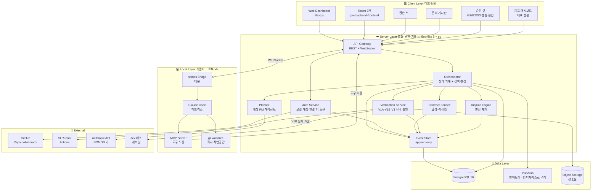

<aside>
🔑

**가장 중요한 경계선:** 서버는 **코드를 실행하지 않습니다.** 실행은 전부 로컬에서 일어나고, 서버는 조율·권한검증·기록만 합니다. V1B도 코드를 돌리는 게 아니라 이미 배포된 dev 서버에 HTTP 요청을 보내는 것입니다. 이게 보안 모델과 비용 구조를 동시에 단순화합니다.

**예외 하나:** 내장 PM은 NOMOS 서버에서 NOMOS의 API 키로 돕니다. 코드를 실행하진 않지만 **LLM 비용은 우리가 냅니다** — 그래서 PM 예산이 필수입니다(§2.1).

</aside>

---

# 2. 레이어별 컴포넌트 카탈로그

## 2.1 Server Layer — 8개 서비스

| **컴포넌트** | **단일 책임** | **입력** | **출력** |
| --- | --- | --- | --- |
| **API Gateway** | REST 진입점 + WebSocket 허브. 연결 생명주기·재연결·하트비트 관리 | HTTP 요청, WS 프레임 | 라우팅된 내부 호출 |
| **Auth Service** | 로컬 계정(scrypt), 개인 연결 키, 사람·에이전트 토큰(JWT HS256) 발급·갱신. GitHub OAuth는 병존 예정 | 가입·로그인·연결 요청 | access token (`kind`, `sub`, 책임 귀속) + refresh token |
| **Orchestrator** ⭐ | **상태 기계.** 태스크 전이 판단, 의존성 해소, 배정, 에스컬레이션. **허용 레벨 정책 판정**(`project_policies`)과 **프로젝트 정지 게이트** | 전이 요청, 검증 결과 | 상태 변경 이벤트, WS 푸시 |
| **Planner (PM)** | 요구사항 → EARS 명세서 → 태스크 DAG. 피드백 분류. PM_REVIEW 반려, 이의 판정 설명. **NOMOS 서버에서 NOMOS 키로 실행** — 명세 작성은 Sonnet급, 라우팅·요약은 Haiku급. 프로젝트별 PM 예산 | 대표 자연어 | structured JSON (명세서, DAG, 분류), rationale |
| **Contract Service** | 계약 제안/역제안 중계, 락, **Mock·스텁 자동생성**, 버전관리 | OpenAPI 조각 | LOCKED yaml + MSW/Zod 코드 |
| **Verification** | V1A·V1B·V3는 서버가 직접, V2·V4는 브릿지 결과를 받아 판정. 걸린 행동 키를 정책 판정에 넘김 | 산출물 diff, dev 주소 | PASS/FAIL + 실패 로그, triggered_actions |
| **Dispute Engine** ⭐ | 이의제기 수리 → **자동 검증으로 판정** → 차단/재개. 핑퐁 카운터 | DISPUTE_RAISED + evidence | 판정 결과, UNBLOCK 이벤트 |
| **Event Store** | append-only 로그. 리플레이·디버깅·**지표 산출의 유일한 원천** | 모든 서비스의 이벤트 | 프로젝션 (칸반·Room·지표) |

## 2.2 Local Layer — 브릿지 내부 구조

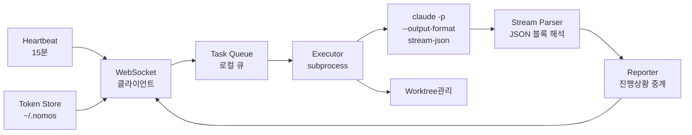

| **모듈** | **책임** | **주의점** |
| --- | --- | --- |
| WebSocket 클라이언트 | 서버 이벤트 수신, 재연결 (지수 백오프), 마지막 수신 이벤트 id부터 재개 | **폴링 금지** — 비용 100배 차이. `'error'` 핸들러가 없으면 프로세스가 죽음 |
| Task Queue | 동시 실행 상한(`max_concurrent`) 준수 | Agent Card의 값과 일치해야 함 |
| Executor | 헤드리스 기동, 프롬프트 조립 (헌법 → 계약 → 명세 → ADR → 수용기준, 안정→가변 순서). 실행 중 자식 프로세스 핸들 보관 | 타임아웃·강제종료 필수. **Windows에서 `shell: true` 금지**, stdin 즉시 닫기 |
| Stream Parser | `stream-json` 블록 해석 → 토큰·도구호출·결과 분리 | ✅ **스파이크로 검증 완료.** 블록 순서에 의존하지 말 것 (`rate_limit_event`가 어디든 끼어듦) |
| MCP Server | 에이전트에게 `claim_task`, `submit_artifact`, `raise_dispute`, `propose_contract`, `ask_principal` 노출 | ✅ 헤드리스 Claude Code가 실제로 호출함을 확인. 호출 전 ToolSearch 1턴이 고정으로 붙음 |
| Worktree 관리 | 태스크별 격리 브랜치, 레포별 작업 디렉터리 | 역할당 에이전트 1개 + 경로 소유권이라 두 에이전트가 같은 경로를 쓰지 않음 |

하니스 실측 내용 전체는 `harness-claude-code.md`.

## 2.3 Client Layer — 5뷰

| **뷰** | **사용자** | **데이터 소스** | **MVP** |
| --- | --- | --- | --- |
| Room 3개 (`pm`·`backend`·`frontend`) | `pm`은 대표만, `backend`·`frontend`는 해당 역할. 대표는 전체 | events 프로젝션 (`room_id`) | ✅ Must |
| 칸반 보드 | 팀원은 자기 역할 태스크만, 대표는 전체 | tasks 프로젝션 | ✅ Must |
| 문서 게시판 | 프로젝트 전원, **역할 필터 없음** — 역할 간 유일한 교차 창구 | documents | ✅ Must |
| 승인 큐 | 대표·해당 역할 담당자 | approvals | ✅ Must (G1/G3 + 행동 승인) |
| 지표 대시보드 | **대표 전용** | events 집계 (M1~M8) | ✅ Must — 3차 회의 결정 |

> **다른 Room은 존재 자체를 노출하지 않습니다.** 권한 없는 Room은 403이 아니라 404, 목록에서도 빠집니다. (가시성 규칙은 계획 단계 — 미구현)

## 2.4 Observability Layer — 단명료에서 승격 ⭐

<aside>
👁️

3차 회의의 "사람 및 감독관이 확인할 수 있어야 함" + "채팅창 아카이빙화" 요구를 반영한 결과입니다. 대시보드를 나중에 붙이는 게 아니라, **이벤트 스트림의 1급 소비자**로 설계합니다.

</aside>

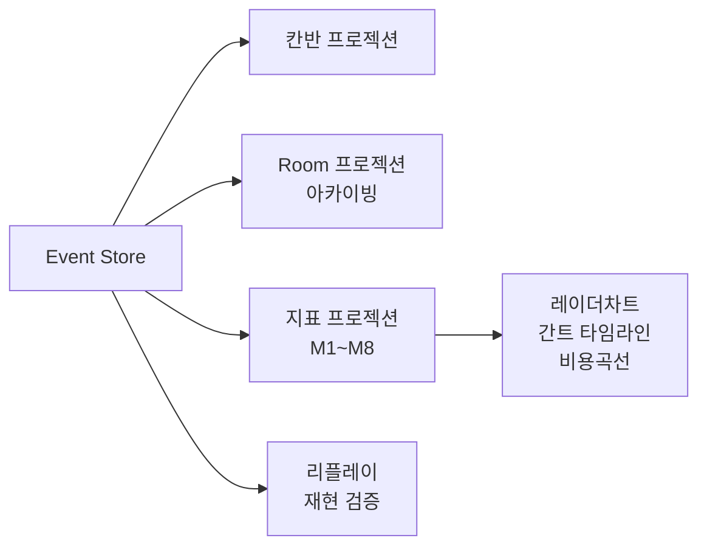

**4개 프로젝션이 모두 같은 `events` 테이블에서 파생됩니다.** 이게 이벤트 소싱을 쓰는 진짜 이유입니다.

---

# 3. 파이프라인 상세 — Phase별 시퀀스

## 3.0 온보딩 전체 — 4단계 상세 ⭐

<aside>
🎯

온보딩은 **네 개의 서로 다른 작업**입니다. 하나로 뭉치면 안 됩니다.
**A. 가입·연결**(모두, 각 1회) · **B. 조직 온보딩**(대표, 1회) · **C. 프로젝트 온보딩**(대표, 프로젝트마다) · **D. 팀원 합류**(초대받은 사람)

순서는 **A → B → C → D**. 팀원의 A는 초대와 무관하게 미리 해둘 수 있어 병렬로 진행됩니다.

</aside>

<aside>
🚨

**선행 조건: GitHub collaborator 초대가 먼저입니다.**
우리 서버는 GitHub 레포 접근 권한을 **만들어낼 수 없습니다.** 우리 토큰은 "우리 도구를 부를 수 있는가"만 결정하고, clone·push 권한은 전적으로 그 사람의 GitHub 계정 권한입니다. 대표가 GitHub에서 collaborator로 추가하지 않으면 팀원은 D-3에서 막힙니다.

</aside>

### 권한은 두 겹입니다

| **권한** | **결정 주체** | **없으면** |
| --- | --- | --- |
| GitHub 레포 접근 | 대표가 GitHub에서 부여 | clone 자체가 실패 |
| 우리 시스템 권한 | 대표가 경로 소유권(B-2)과 초대 역할(D-1)로 정의 | 태스크를 받을 수 없음 |

> 둘 다 있어야 일할 수 있습니다. collaborator인데 미합류면 → 코드는 고치지만 태스크를 못 받습니다. 합류했는데 collaborator가 아니면 → 태스크는 받지만 clone에서 실패합니다.
> 

---

### A. 가입·연결 (모두, 약 5분)

#### A-1. 가입

```
[웹] ourhq.io → 회원가입
  아이디 / 비밀번호 / 닉네임
  → 가입 완료 (아직 조직 없음)

  🔑 개인 연결 키
     x7Kp……………………Q2   [복사]
     ⚠️ 이 화면에서만 보입니다. 잃어버리면 재발급하세요.
```

<aside>
🔑

**연결 키는 서버에 해시만 남습니다.** 재조회 경로가 없고, 재발급하는 순간 기존 키는 무효입니다. 비밀번호는 scrypt로 저장합니다. GitHub 계정 없이 가입할 수 있습니다(GitHub OAuth는 병존 예정).

</aside>

#### A-2. CLI 연결

```bash
$ npx nomos connect

  NOMOS 브릿지를 설치합니다...
  연결 키: ****************************
  에이전트 이름 [minsu-laptop]:

  ✅ 연결됨 — 상태: pending (조직·프로젝트 합류 전)
```

- **조직·프로젝트가 없어도 연결됩니다.** 합류하는 순간 이 에이전트가 함께 조직에 편입됩니다.
- 틀린 키는 **400 + 일반 메시지**. 무엇이 틀렸는지 알려주지 않습니다.
- 같은 이름으로 다시 연결하면 새로 만들지 않고 기존 에이전트를 갱신합니다(CLI 재설치 대응).

#### A-3. 환경 검사 (preflight) ⭐

```
환경을 검사합니다...

  ✅ Claude Code 감지됨            v2.1.263
  ✅ git 사용 가능                 v2.43
  ✅ worktree 생성 테스트          통과
  ✅ WebSocket 연결                RTT 42ms

  ⚠️ 충돌 가능성 있는 MCP 2개
     github-mcp      이 프로젝트에서 비활성화됩니다
     filesystem-mcp  이 프로젝트에서 비활성화됩니다
     ℹ️ 개인 설정은 유지되며, 이 프로젝트 작업공간에서만 격리됩니다.

  ⚠️ 동시 실행 상한: 2  [변경]
              [이유 보기] [동의하고 계속] [취소]
```

레포 접근 권한 확인은 조직에 합류한 뒤(D-3)에 합니다. 이 시점엔 아직 레포가 없습니다.

<aside>
🚫

**MCP 격리와 레포 접근은 선택이 아니라 조건입니다.** 거부하거나 미충족이면 온라인이 될 수 없습니다. `agents` 레코드는 만들되 상태를 `pending`으로 두고, 조건이 충족되면 `online`으로 전환합니다.

</aside>

**미지원 하니스는 여기서 명확히 차단:**

```
❌ Cursor는 현재 지원하지 않습니다.
   헤드리스 실행 모드가 없기 때문입니다.
   Claude Code를 설치한 뒤 다시 시도해주세요.
```

#### A-4. 연결 완료

```
✅ 토큰 저장           ~/.nomos/credentials
✅ MCP 서버 등록       프로젝트 전용 설정
✅ git 훅 설치         pre-commit
✅ 브릿지 데몬 기동     PID 48291
✅ Agent Card 등록

minsu-laptop 대기 중. 조직에 합류하면 작업을 받습니다.
```

---

### B. 조직 온보딩 (대표, 약 15분)

#### B-0. 조직 생성

```
[웹] 로그인 → "새 조직 만들기"
  조직명: study-app-team
  → ✅ 생성 완료. 당신이 이 조직의 대표입니다.
```

- **조직을 만든 사람이 대표**가 됩니다. 조직당 대표 1명은 DB가 강제합니다.
- 한 사람은 한 조직에만 속합니다. 이미 조직이 있으면 만들 수 없습니다.
- 대표가 A에서 연결해 둔 에이전트가 있다면 함께 조직에 편입됩니다.

#### B-1. 레포 연결 — 복수 선택 가능

```
연결할 레포를 선택하세요 (복수 선택 가능)

  ☑ our-company/study-app-web
  ☑ our-company/study-app-api
  ☐ our-company/study-app-docs
```

<aside>
💡

**FE 레포와 BE 레포는 완전히 분리합니다.** 레포 경계가 그대로 소유권 경계가 되어 경로를 일일이 나눌 필요가 없고, worktree 격리도 구조적으로 깔끔해집니다. **통합 브랜치는 없습니다** — 각 레포가 자기 dev 브랜치로 수렴하고 dev에 배포합니다.

</aside>

#### B-2. 경로 소유권 정의 ⭐ — 온보딩의 핵심 산출물

레포를 연결하면 기본 규칙 15개가 자동으로 들어갑니다. 대표는 `**` 행의 소유 역할만 정하면 됩니다.

```
[ study-app-web ] [ study-app-api ]

  study-app-web
    **                         →  [프론트엔드 ▾]  쓰기
    tests/**                   →  테스트 작성
    requirements.txt           →  패키지 추가      (package.json은 의존성 diff로 판정)
    migrations/**, **/*.sql    →  DB 스키마 변경    (승인은 허용 레벨에 따라)
    .github/**, Dockerfile     →  CI 변경          (승인은 허용 레벨에 따라)
    contracts/**               →  읽기 전용
    **/.env*, **/*.pem, **/*.key, **/id_rsa*, **/secrets/**  →  🔒 절대 금지
    **/.env.example            →  예외: 쓰기 허용

  ℹ️ 세부 경로를 나누려면 [+ 경로 추가]
```

<aside>
⚠️

**기본은 거부입니다.** `**` 행이 레포의 모든 경로를 덮으므로 "미분류 경로"는 생기지 않습니다. 대신 **`**`의 소유 역할이 비어 있으면 어느 역할도 쓸 수 없습니다.** 레포를 연결하고 소유자를 지정하지 않으면 그 레포에서는 태스크를 받을 수 없습니다(프로젝트 생성 시점에 422로 알려줍니다). MCP 격리(§5.3)와 같은 원칙입니다.

소유 역할은 **상속**됩니다. `tests/**`·`migrations/**`처럼 소유자를 따로 정하지 않은 행은, 그 파일을 덮는 행 중 **소유자가 정해진 가장 높은 행**(보통 `**`)을 따릅니다. 접근(쓰기·읽기 전용·금지)과 승인 등급은 이기는 행 그대로입니다. 그래서 대표가 `**`만 정해도 테스트·마이그레이션 파일이 그 역할의 것이 되고, 다른 역할은 건드릴 수 없습니다.

</aside>

**스키마 — `repo_paths`:**

```sql
repo_paths (id, repo_id, path_pattern, owner_role, access, action_key, priority, source)
-- (…, web_repo, '**',           'FRONTEND', 'write',  NULL,            10, 'seed')
-- (…, web_repo, 'migrations/**', NULL,      'write',  'db:migration',  50, 'seed')
-- (…, web_repo, '**/.env*',      NULL,      'denied', 'secret:touch', 900, 'seed')
```

- 한 파일에 여러 규칙이 맞으면 **`priority`가 높은 규칙**이 이깁니다. priority는 레포 안에서 유일하고 대역이 정해져 있습니다: `0~99` 시드 · `100~199` 스캔 · `200~299` 대표 추가 · `900+` 조직 상한(수정 불가).
- 예외는 부정 문법 대신 **더 높은 priority의 허용 행**으로 표현합니다 (`**/.env.example` 950이 `**/.env*` 900을 뚫음).
- `action_key`는 허용 레벨 정책표(§5 6단계)의 어느 칸에 걸리는지를 뜻합니다. 비어 있으면 `code:own_path`.
- 패턴 문법은 `**`, `*`, 리터럴만 허용합니다. 서버와 브릿지의 `.claude/settings.json`이 같은 패턴을 다르게 읽지 않게 하기 위해서입니다.
- 기본 규칙 목록은 `src/domain/repo/seed-paths.ts`. `source='seed'`로 표시해 나중에 시드가 바뀌어도 대표가 손으로 추가한 행은 보존합니다.

#### B-3. 프로젝트 헌법 — 체크박스 위주

자유 텍스트로 두면 아무도 안 씁니다.

```
기술 스택 (에이전트가 만드는 앱의 스택)
  프론트: [Next.js 15 ▾]  백엔드: [Fastify + Zod ▾]  DB: [PostgreSQL ▾]

코딩 규칙
  ☑ 터치 타겟 최소 44px        ← 데모 §9.4에서 인용되는 조항
  + 직접 입력...
```

체크한 항목은 에이전트 프롬프트에 자동 주입되고, 피드백 라우팅 때 근거로 인용됩니다.

> **승인·금지 규칙은 헌법에 두지 않습니다.** "승인 없이 마이그레이션 금지", ".env 수정 금지", "패키지 추가 시 승인" 같은 규칙은 허용 레벨(C)과 경로 규칙(B-2)이 정합니다. 두 곳에 두면 서로 어긋납니다.

---

### C. 프로젝트 온보딩 (대표, 약 3분)

```
프로젝트명: 스터디 관리 웹앱 v1
마감일: 2026-09-08

PM 예산: $40            ← 필수. PM은 NOMOS 키로 실행됩니다
전체 예산 상한: $300     ← 선택
  ⚠️ 80% 도달 시 알림, 100%에서 승인 전까지 정지

허용 레벨 — 행동마다 누가 승인하는가
  ○ L1  계약 제안·산출물 제출·패키지·파일 삭제·스키마·CI 모두 사람 승인
  ● L2  산출물·PR은 자동 / 계약 제안·패키지·파일 삭제는 PM 검토 / 계약 변경·스키마·CI는 사람
  ○ L3  L2 + 파일 삭제 자동, 계약 변경 PM 검토
  ○ L4  계약 제안·패키지 자동 / 계약 변경·스키마·CI도 PM 검토

  🔒 레벨과 무관: main 머지는 사람 승인 · 범위 밖 수정·비밀 파일·배포는 금지
  [레벨별 전체 표 보기]
```

#### 허용 레벨 → 시스템 파라미터 매핑

| **항목** | **값** |
| --- | --- |
| 행동별 승인 | 선택한 레벨의 열(17행)이 `project_policies`로 복사됨. 이후 판정은 이것만 봄 |
| 🔒 행 | 레벨과 무관하게 고정. 대표도 못 바꿈 |
| 비잠금 행 | G1 전까지 대표가 조정 가능 *(해석 — 미결 참고)* |
| 승인 게이트 | G1·G3는 모든 레벨 필수, G2는 범위·계약 변경 시 |
| 핑퐁 상한 · 검증 재시도 | 3회 · 3회 (레벨과 무관) |
| 예산 초과 | 모든 레벨에서 사람 승인 (`budget:exceed`) |

전체 표의 원본은 `migrations/004_policy_levels.sql`.

<aside>
❌

**물어보지 않는 것 3가지**
**모드** — PM이 마감일·요구사항을 보고 G1에서 제안합니다. 미리 물으면 P4 원칙과 충돌합니다.
**팀 규모** — 합류한 에이전트 수로 서버가 이미 압니다.
**요구사항 명확도** — PM이 지시문을 파싱하는 게 더 정확합니다.

</aside>

---

### D. 팀원 합류 (초대받은 사람, 약 5분)

#### D-1. 초대 링크 발급 (대표) — GitHub 초대가 선행

```
⚠️ 초대 링크를 보내기 전에
   팀원들이 레포에 접근할 수 있어야 합니다.

   현재 collaborator (2명)
     ✅ daepyo
     ✅ jihoon
     ❌ minsu — 아직 초대되지 않음
   [GitHub에서 관리]

초대 링크: https://ourhq.io/join/AbC123XyZ
  유효기간 7일
  역할: [백엔드 ▾]        ← 초대할 때 역할을 정합니다

역할별 기본 권한
  프론트엔드  →  web 레포 쓰기, api 레포 읽기
  백엔드     →  api 레포 쓰기, web 레포 읽기
```

서버가 GitHub API로 collaborator 목록을 읽어 표시하면 누가 아직 초대 안 됐는지 한눈에 보입니다.

> **역할은 합류하는 사람이 고르지 않습니다.** 대표가 초대에서 지정하고, 프로젝트마다 역할당 에이전트 1개입니다(실험 통제). 역할은 FRONTEND·BACKEND 2종이며 QA는 없습니다.

#### D-2. 수락 + 권한 동의 ⭐ — 데모에서 인용될 자산

```
┌──────────────────────────────────────────────┐
│ study-app-team 에 합류합니다 — 역할: 프론트엔드  │
├──────────────────────────────────────────────┤
│ minsu-laptop 이 받게 되는 권한                   │
│                                              │
│  ✓ study-app-web/**     읽기·쓰기              │
│  ✓ study-app-api/**     읽기만                 │
│                                              │
│  ✓ 작업 수령 및 산출물 제출                     │
│  ✓ API 계약 제안, 이의 제기, 사람에게 질문        │
│                                              │
│  ⏸ 패키지 추가·스키마·CI 변경  허용 레벨에 따라 승인 │
│  ✗ .env · *.pem · *.key · secrets/  절대 금지   │
│  ✗ 배포                        도구 자체가 없음   │
│                                              │
│  이 권한은 대표가 정한 상한을 넘을 수              │
│  없으며, 좁힐 수만 있습니다.                     │
│              [동의] [권한 좁히기] [취소]         │
└──────────────────────────────────────────────┘
```

- 로그인한 사용자 기준으로 수락합니다. 수락하는 순간 **계정과 먼저 연결해 둔 에이전트가 함께 조직에 편입**됩니다.
- 이미 다른 조직 소속이면 수락할 수 없습니다. 같은 초대를 다시 눌러도 성공으로 처리합니다.
- 두 사람이 같은 링크를 동시에 수락하면 한 명만 성공합니다.

<aside>
🎬

이 화면이 **데모 5:00 권한 차단 장면에서 되짚어질 자산**입니다. "온보딩 때 이렇게 동의했기 때문에 차단된 것"이라고 연결할 수 있도록 스크린샷으로 남을 만큼 깔끔해야 합니다.

</aside>

#### D-3. 레포 접근 확인

```
  레포 접근 권한 확인
  ✅ study-app-web     collaborator 확인됨
  ❌ study-app-api     접근 불가
     → 대표에게 GitHub 초대를 요청해주세요
     [대표에게 알림 보내기]  [다시 확인]
```

<aside>
❓

**미결:** collaborator 확인에는 그 사람의 GitHub 계정이 필요합니다. 로컬 계정만 있는 사용자를 어떻게 GitHub 계정과 연결할지(OAuth 연결, 로그인명 입력 등)는 정해지지 않았습니다. §12 참고.

</aside>

#### D-4. 온라인

```
✅ 조직 합류           study-app-team (프론트엔드)
✅ 레포 접근            study-app-web
✅ 환경 검사            통과

minsu-laptop 온라인. 작업 대기 중입니다.
```

대표 대시보드에 노드가 하나 추가됩니다 — **데모 0:00 장면**이 바로 이것입니다.

**멀티 레포일 때 워크스페이스 구조:**

```
~/.nomos/workspaces/
  study-app-team/
    study-app-web/     ← worktree (쓰기)
    study-app-api/     ← worktree (읽기 — 계약·타입 참고용)
```

태스크마다 **어느 레포에서 작업할지 명시하는 필드**(`tasks.repo_id`)가 있고, Executor가 해당 디렉터리에서 하니스를 띄웁니다.

---

### 전체 타임라인

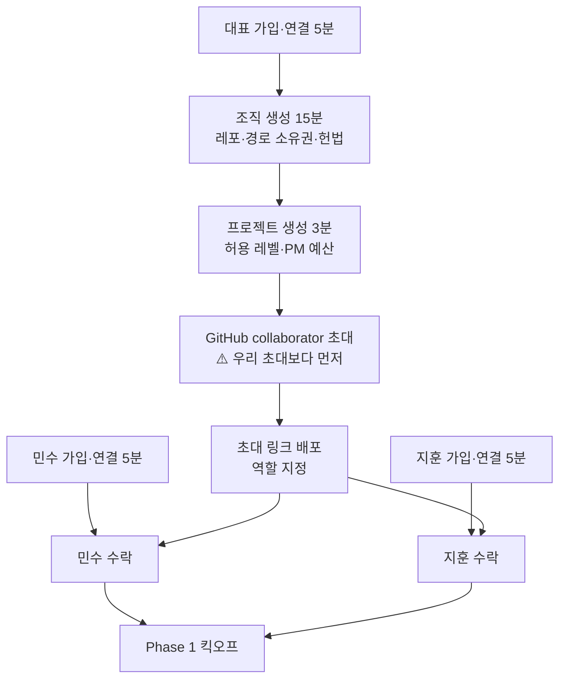

> 팀원의 가입·연결은 초대와 무관하게 미리 할 수 있습니다. 병렬 진행 시 **30분 안에** 전체 온보딩 완료. 이게 목표선입니다.
> 

### 온보딩이 만들어낸 데이터

| **테이블** | **건수** | **내용** |
| --- | --- | --- |
| users | 3 | 대표 1, 팀원 2 (로컬 계정) |
| agents | 2 | minsu-laptop(FE), jihoon-laptop(BE) — 대표가 연결했다면 +1 |
| organizations | 1 | 헌법 |
| repos | 2 | web, api |
| repo_paths | 30 | **레포당 기본 규칙 15개 ← M5의 기준선** |
| invites | 2 | 역할 지정 |
| projects | 1 | 허용 레벨, PM 예산, 마감 *(Phase 2)* |
| project_policies | 17 | 레벨 열 복사 *(Phase 2)* |
| events | 14+ | USER_SIGNED_UP ×3, AGENT_CONNECTED ×2, ORG_CREATED, REPO_CONNECTED ×2, INVITE_CREATED ×2, INVITE_ACCEPTED·MEMBER_JOINED ×2 … |

<aside>
🚨

**`repo_paths`가 가장 중요합니다.** 권한 검증 3·4단계(§5)와 검증 V3(§6)가 전부 이 데이터를 참조합니다. **온보딩이 부실하면 M5·M8 두 지표가 동시에 죽습니다.**

</aside>

### 온보딩 MVP 절단선

| **반드시 (Must)** | **있으면 좋음 (Should)** | **버릴 것 (Won't)** |
| --- | --- | --- |
| 로컬 계정 가입 + 연결 키 | GitHub OAuth, collaborator 확인 | 다중 조직 지원 |
| 권한 동의 화면 | preflight 상세 체크 | 팀 규모·명확도 질문 |
| 경로 소유권 (기본 규칙 15개) | 자동 경로 제안 (디렉터리 스캔) | 온보딩 진행률 애니메이션 |
| 허용 레벨 L1~L4 | 비잠금 정책 행 조정, 헌법 체크박스 | 초대 링크 UI (URL 직접 전달) |
| 브릿지 연결 + MCP 격리 | 레포 내 경로 세분화 | 레포 3개 이상 |
| 레포 2개 (web + api) | — | 크로스 레포 원자적 커밋 |

## 3.1 Phase 0 시퀀스 — 가입·연결 상세

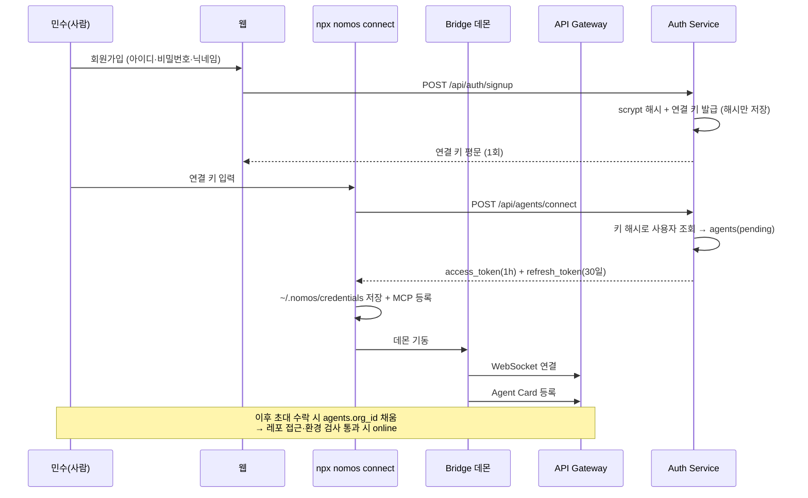

**산출물:** `users` 1개, `agents` 1개, `events`에 `USER_SIGNED_UP`·`AGENT_CONNECTED` 각 1건 — 둘 다 조직이 없으므로 `org_id`는 NULL

<aside>
💡

**3차 회의 "온보딩 옵션 선택 중요"** — 권한 동의 화면(D-2)을 체크박스로 만들어 사용자가 직접 범위를 좁힐 수 있게 합니다. 단, **대표가 정한 상한을 넘어설 수는 없음** (권한은 상속만, 확장 불가).

</aside>

## 3.2 Phase 1~2 — 킥오프와 계약 락

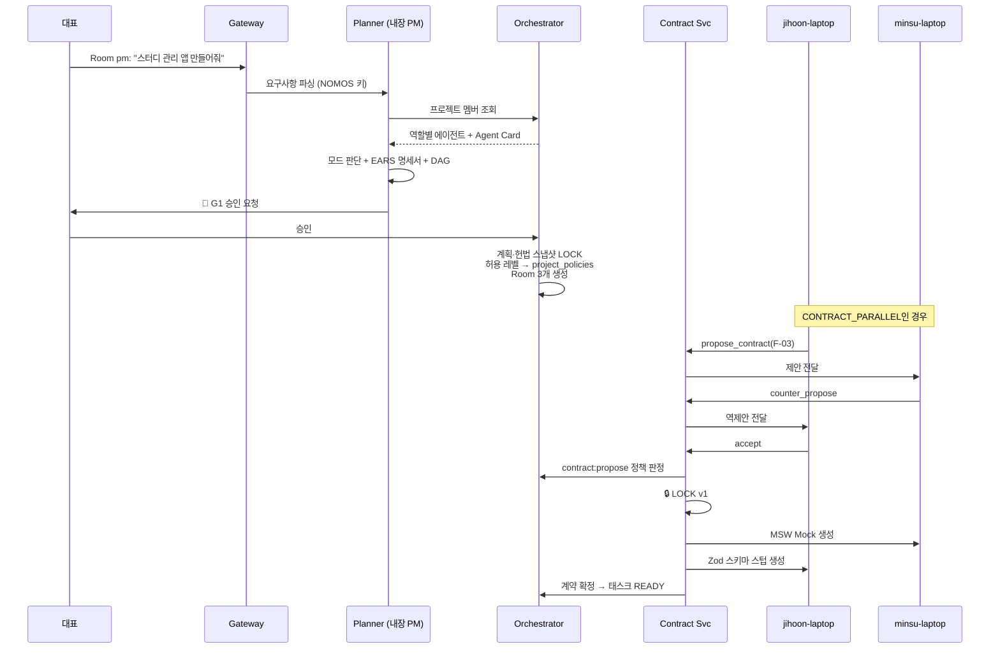

<aside>
⚠️

**협상 라운드 상한은 3회입니다.** 3회 안에 합의 안 되면 PM이 조정안을 제시 → 그래도 안 되면 대표 에스컬레이션. PM은 조정안을 낼 뿐 합의를 대신 확정하지 않습니다. 이게 없으면 계약 협상 자체가 AutoGen처럼 무한루프에 빠집니다.

</aside>

## 3.3 Phase 3 — 태스크 실행 루프 (핵심)

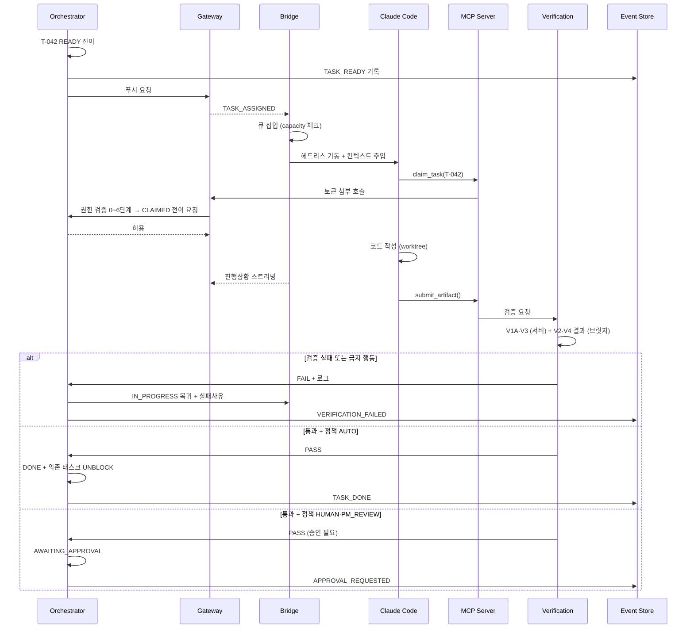

**프롬프트 주입 구성 (Executor가 조립, 안정 → 가변 순서):**

```
[시스템] 프로젝트 헌법 (기술스택, 컨벤션)
[계약] 🔒 contracts/F-03.yaml v1  ← 수정 불가 명시
[컨텍스트] 기능명세서 F-03 (EARS)
[참고] 관련 ADR 목록
[도구] MCP로 노출된 함수 목록
[수용기준] 이 작업의 통과 조건       ← 태스크마다 바뀜
[제약] 수정 가능 경로: study-app-web/**
```

> 순서가 곧 비용입니다. 스파이크 실측에서 비용의 대부분이 캐시 토큰이었고, 앞쪽이 바뀌면 캐시가 통째로 깨집니다.

## 3.4 Phase 4 — 이의제기 판정 파이프라인 ⭐⭐

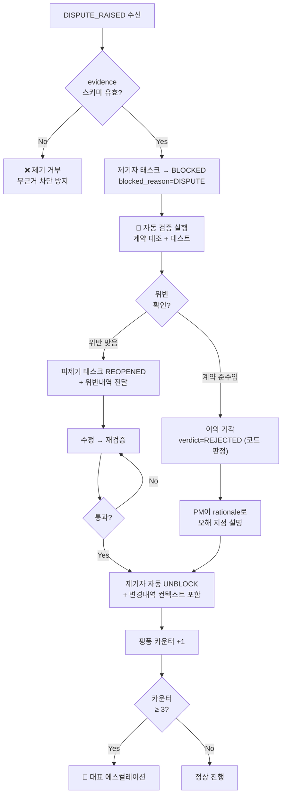

<aside>
⭐

**`E` 분기가 이 프로젝트의 심장입니다.** "계약 준수인데 이의제기됨" 경로가 있어야 **거짓 주장을 기각**할 수 있고, 이게 평가 설계서의 결함주입 실험 5번(거짓 주장)과 직결됩니다.

**기각도 코드가 합니다.** PM은 `disputes.rationale`에 설명만 쓰고 `verdict`를 뒤집을 수 없습니다(P2).

</aside>

---

# 4. Orchestrator 내부 설계

## 4.1 이벤트 소싱 + 상태 기계 결합

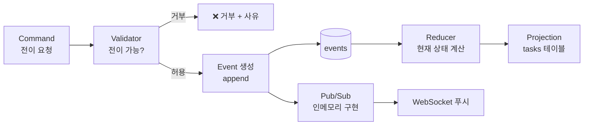

<aside>
🔑

**전이 가능 여부를 판단하는 것은 Validator 하나뿐입니다.** 에이전트도, UI도, 다른 서비스도 상태를 직접 쓰지 않습니다. 이게 P1 원칙의 구현체입니다.

**상태 변경과 이벤트 기록은 같은 트랜잭션입니다.** events에 쓰는 경로는 `appendEvent(tx, …)` 하나뿐이고, 이벤트 기록이 실패하면 상태 변경도 롤백됩니다(구현됨).

**Pub/Sub은 인터페이스로 감싼 인메모리 구현으로 시작합니다.** 서버가 여러 대가 되면 구현만 교체합니다. Redis는 지금 필요 없습니다.

</aside>

## 4.2 전이 규칙 테이블 (서버 내부 상수)

상태는 8개입니다: `READY · CLAIMED · IN_PROGRESS · VERIFYING · AWAITING_APPROVAL · BLOCKED · ESCALATED · DONE`

| **현재** | **이벤트** | **다음** | **가드 조건** |
| --- | --- | --- | --- |
| READY | CLAIM | CLAIMED | 에이전트 online + capacity 여유 + 태스크 역할 일치 |
| CLAIMED | START | IN_PROGRESS | 의존 태스크 전부 DONE |
| IN_PROGRESS | SUBMIT | VERIFYING | 산출물(커밋) 존재 — 별도 SUBMITTED 상태 없음 |
| VERIFYING | PASS | DONE | 검증 전부 통과 + 정책 판정 AUTO |
| VERIFYING | PASS | AWAITING_APPROVAL | 검증 전부 통과 + 가장 엄격한 판정이 HUMAN·PM_REVIEW |
| VERIFYING | FAIL / FORBIDDEN | IN_PROGRESS | 재시도 카운터 &lt; 3 |
| VERIFYING | FAIL / FORBIDDEN | ESCALATED | 재시도 카운터 ≥ 3 |
| AWAITING_APPROVAL | APPROVE | DONE | HUMAN 승인, 또는 PM_REVIEW에서 반려 없음 |
| AWAITING_APPROVAL | REJECT | IN_PROGRESS | 반려 사유 전달 |
| IN_PROGRESS | DISPUTE | BLOCKED | evidence 스키마 유효, `blocked_reason=DISPUTE` |
| IN_PROGRESS | QUESTION | BLOCKED | `ask_principal` 호출, `blocked_reason=QUESTION` |
| IN_PROGRESS | WAIT_DEPENDENCY | BLOCKED | `blocked_reason=DEPENDENCY` |
| BLOCKED | RESOLVED | IN_PROGRESS | 원인 해소 + 변경내역 준비됨 |
| DONE | DENY | IN_PROGRESS | 대표 deny + 분류가 QUALITY/BUG |
| (모든 상태) | HALT | 동결 | 프로젝트 정지 — IN_PROGRESS는 READY로 회수 |

---

# 5. 권한 검증 파이프라인 ⭐

<aside>
🔐

**이 파이프라인이 M5(권한 위반 차단률)과 M8(책임 추적 완결성)의 구현체입니다.** 경쟁사가 측정조차 못 하는 지표가 여기서 나옵니다.

</aside>

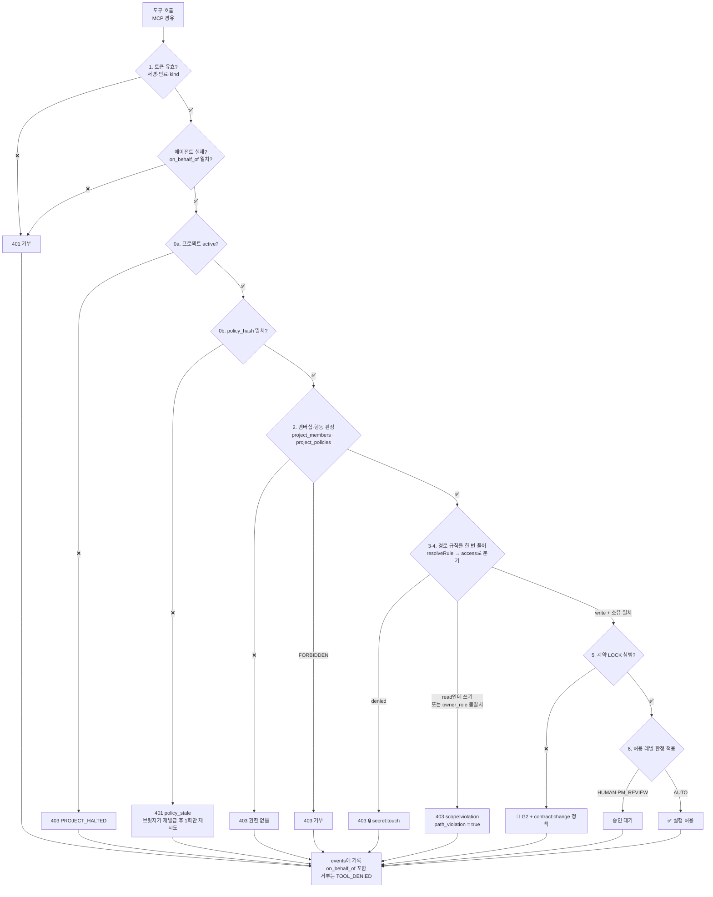

> **실행 순서와 판정 순서가 다릅니다.** 그림은 실행 순서다 — 클레임을 읽으려면 서명 검증(1)이 물리적으로 먼저여야 하므로
> 0a·0b가 그 뒤에 온다. 판정 순서로는 0a(정지)가 가장 먼저이고, 정지된 프로젝트는 토큰이 아무리 신선해도 뚫리지 않는다.
>
> **3·4단계는 한 노드다.** 경로마다 규칙을 한 번만 풀고 그 규칙의 `access`로 금지와 소유권을 함께 판정한다.
> 소유권을 먼저 보면 `.env`(owner_role NULL)가 `scope:violation`으로 잘못 기록되어 M5′ 분자가 오염된다.
>
> **6단계는 아직 호출부가 없다.** 판정값(`gate`)은 2단계에서 이미 나와 있고, 그걸 승인 카드·PM 검토로 잇는 부분이 Phase 2다.

<aside>
💡

**0단계는 토큰 검증보다 먼저입니다.** 멈춤은 명령이 아니라 상태이므로, 브릿지가 오프라인이라 정지 신호를 못 받았더라도 요청이 서버에 들어오는 순간 막힙니다.

**실패도 반드시 기록합니다.** 차단된 요청이 events에 쌓여야 M5 분모가 나옵니다. 데모 5:00 장면(`@minsu-laptop study-app-api의 auth.ts 고쳐줘` → ❌)도 여기서 나옵니다.

**"금지"와 "승인 필요"는 다른 단계입니다.** 3·4단계(범위 밖, 비밀 파일)는 🔒 금지이고, 마이그레이션·CI·패키지는 6단계에서 레벨에 따라 승인을 받습니다.

</aside>

## 5.1 토큰 신뢰 모델 — 왜 위조가 불가능한가 ⭐

<aside>
🔏

**핵심: 서버가 에이전트를 검사하는 게 아니라, 에이전트가 자기 자격을 증명합니다.**
서버 입장에서 들어오는 건 그냥 네트워크 요청입니다. 상대가 진짜 민수 노트북인지 확인할 방법이 없으므로, 방향을 뒤집어 **요청하는 쪽이 매번 증거를 첨부**하게 만듭니다.

</aside>

### 서명이 만드는 불변성

토큰 내용 뒤에는 **서버 비밀키로 만든 서명**이 붙습니다. 내용을 한 글자라도 고치면 서명이 깨집니다.

| **공격 시나리오** | **결과** |
| --- | --- |
| `kind`를 `agent` → `user`로 바꿔 사람 전용 API 호출 | 서명 검증 실패 → 거부 |
| `user_id`(책임 귀속)를 `jihoon`으로 바꿔치기 | 서명 검증 실패 → 거부 |
| 헤더를 `alg: none`으로 바꿔 서명 없이 통과 시도 | 헤더를 발급값과 바이트 단위로 비교 → 거부 |
| 토큰 전체를 새로 만들어냄 | 서버 비밀키가 없으니 불가능 |

> **토큰은 "누구인가"만 증명합니다.** 조직·역할·경로 소유권·프로젝트 상태·허용 레벨은 **매 요청 서버가 DB에서 판정**합니다.
> 토큰에 역할이나 스코프를 구워 넣으면 (1) 역할이 바뀌어도 만료 전까지 옛 권한이 남고, (2) 프로젝트를 정지해도 토큰이 살아 있는 동안 막을 수 없습니다. "멈춤은 명령이 아니라 상태" 원칙과 정면으로 충돌합니다.

### 정책 신선도 — `policy_hash`

권한을 토큰에 넣지 않으므로 판정마다 DB를 읽습니다. 그러면 남는 질문은 하나입니다: **이 토큰이 어느 정책 스냅샷 기준으로 발급됐는가.**
토큰에 실린 `policy_hash`가 그 답이고, 검증 0b단계가 `projects.policy_hash`와 대조합니다.

```
policy_hash = sha256(canonicalJson({
  repo_paths(프로젝트 레포 전체), project_policies, projects.constitution_hash
}))
```

| | 내용 |
| --- | --- |
| 무엇이 들어가나 | 경로 규칙 · 해석된 판정 17행 · 헌법 해시. 셋 중 하나만 바뀌어도 토큰이 죽습니다 |
| 언제 갱신되나 | 경로·정책·헌법이 바뀔 때. G1 이후(`projects.started_at IS NOT NULL`)에는 정책 변경이 금지되므로 사실상 불변입니다 — 운영 중 재발급 폭풍은 없습니다 |
| 브릿지는 | 401 `policy_stale`을 받으면 refresh로 재발급하고 원 요청을 **1회만** 재시도합니다. 재발급 후에도 stale이면 루프이므로 즉시 중단하고 사용자에게 알립니다 |

`policy_hash`는 DB 조회를 대체하는 캐시가 아니라 그 위에 얹는 **무효화 장치**입니다. 조회 자체는 `policy_hash`를 키로 한
프로세스 메모리 캐시로 사라지고, 정책이 바뀌면 키가 통째로 달라지므로 무효화 코드를 따로 짤 필요가 없습니다.
> 

### 신뢰의 뿌리는 연결 키

```
가입 → 연결 키 발급 (평문은 1회, 서버엔 해시만)
  → CLI가 연결 키로 에이전트 등록
  → 서버가 그 사람 몫의 에이전트 토큰을 서명해서 발급
  → 권한 판정은 서버 코드 (에이전트가 설득해도 못 넘음)
```

판단은 LLM이 아니라 **서버 코드**가 합니다. 이게 데모 5:00 장면의 실제 메커니즘입니다.

GitHub OAuth는 병존 예정입니다. GitHub 신원은 collaborator 확인과 커밋 귀속에 쓰입니다(연결 방식은 미결).

### 탈취 대응

| **대응** | **내용** | **상태** |
| --- | --- | --- |
| 짧은 만료 | access token 1시간. 유출돼도 1시간 뒤 무효. 브릿지가 백그라운드 갱신 | ✅ 구현 |
| 갱신 토큰 분리 | refresh token 30일, 요청에 실리지 않고 `~/.nomos/credentials`에만. 서버엔 해시만 | ✅ 구현 |
| 연결 키 재발급 | 새 키 발급 즉시 기존 키 무효 | ✅ 구현 |
| refresh token 폐기 | `agent_tokens.revoked_at` | 🟡 컬럼만 있음 |
| 기기 바인딩 | 토큰을 특정 기기 키에 묶어 탈취해도 사용 불가 | ❌ 향후 과제 |

## 5.2 결정적 한계 — 로컬 직접 수정은 막을 수 없다 ⚠️

<aside>
⚠️

**§5의 권한 검증은 서버로 오는 요청에만 적용됩니다.**
민수가 자기 노트북에서 `vim api/auth.ts`를 열어 고치면 우리 서버는 아무것도 못 합니다. 로컬 파일 시스템이기 때문입니다. **이 한계를 문서화하지 않으면 심사에서 무너집니다.**

</aside>

### 실제 방어선은 두 겹

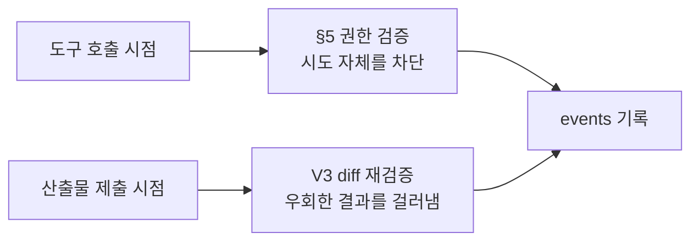

| **방어선** | **막는 것** | **못 막는 것** |
| --- | --- | --- |
| 요청 시점 (§5) | MCP 도구로 범위 밖 접근 시도 | 로컬 편집기 직접 수정 |
| 제출 시점 (V3) | 범위 밖 경로·비밀 파일이 diff에 포함된 산출물 | `git push --no-verify` 강제 푸시 |

<aside>
🎤

**발표에서 이렇게 선을 그으세요:**
"저희는 **정직한 실수**를 막습니다. 악의적 우회는 GitHub 브랜치 보호 규칙 같은 **조직 정책의 영역**입니다."

이건 우리 시스템만의 한계가 아니라 모든 개발 도구의 공통 한계입니다. 회사 CI도 로컬 강제 푸시는 못 막습니다. 이렇게 정리하면 "우회하면 되잖아요" 질문에 흔들리지 않습니다.

</aside>

## 5.3 MCP 격리 정책 ⭐

<aside>
🚫

**선택사항으로 두면 안 됩니다.** 에이전트가 GitHub MCP를 갖고 있으면 `submit_artifact()`를 거치지 않고 직접 push할 수 있어, **V3 검증을 우회**합니다. 그 순간 M5·M8이 무의미해지고 **차별점이 사용자 설정에 따라 켜졌다 꺼졌다** 하게 됩니다. P1 원칙(상태는 서버 소유) 위반이기도 합니다.

</aside>

### 판정 기준: 우리가 소유한 자원을 바꿀 수 있는가

| **MCP** | **판정** | **이유** |
| --- | --- | --- |
| GitHub | 🚫 차단 | 커밋·PR 우회 가능 |
| 파일시스템 | 🚫 차단 | 범위 밖 경로 접근 |
| 셸/터미널 | 🚫 차단 | 뭐든 할 수 있음 |
| Slack, Notion | ✅ 허용 | 코드를 건드리지 않음 |
| 웹 검색 | ✅ 허용 | 읽기 전용 |
| 우리 MCP | ✅ 필수 | 유일한 작업 통로 |

> **애매하면 기본 차단.** 경로 소유권의 기본 거부(§3.0 B-2)와 동일한 원칙입니다.
> 

### 격리 방식 — 삭제가 아니라 프로젝트 단위 분리

개인 설정을 지우지 않습니다. 헤드리스 실행 시 `--mcp-config`로 우리 MCP만 넘기고 `--strict-mcp-config`로 나머지 설정을 무시합니다. 다른 곳에서 쓰던 GitHub MCP는 그대로 남습니다. (등록 방법 3가지는 `docs/harness-claude-code.md`)

### 두 번째 방어선 — git 훅

MCP를 껐다고 안심하면 안 됩니다. 나중에 다시 켤 수도 있고 셸 접근이 남아 있을 수도 있습니다. 브릿지가 worktree 생성 시 **pre-commit 훅**을 심어, 우리 시스템을 거치지 않은 커밋을 막습니다.

---

# 6. 검증 파이프라인 (Verification Service)

| **단계** | **검사 내용** | **실행 위치** | **도구** | **실패 시** |
| --- | --- | --- | --- | --- |
| V1A 스펙 대조 | 산출물의 API 정의가 LOCKED yaml과 일치하는가 | 서버 | Spectral 등 | CONTRACT_VIOLATION |
| V1B 실제 응답 | dev 배포 주소(`repos.dev_base_url`)를 실제로 호출해 계약과 대조 | **서버** | schemathesis 등 | CONTRACT_VIOLATION |
| V2 테스트 | G1에 잠긴 시험지(`spec_tests`, EARS 수용기준에서 생성) 통과 | 브릿지 | vitest | TEST_FAILED |

> **구현 결정(2026-10): 내장 PM은 시험지를 만들지 않는다.** PM 명세는 `tests: []`이고 버그가 아니다. 그 태스크의 V2는
> `SKIPPED`("잠긴 spec_tests가 없다")로 기록되어 통과로 세지 않는다. 이유와 되살리는 방법은 CLAUDE.md "내장 PM" 절.
| V3 권한 | **diff의 모든 경로가 소유 범위 안인가, 비밀 파일이 없는가** | 서버 | `git diff --name-only` + `resolveRule()` | 🔒 scope:violation / secret:touch → 즉시 반려 |
| V4 품질 | 린트, 타입체크, 포맷 | 브릿지 | eslint / tsc | LINT_FAILED |

> **V3가 차별점입니다.** V1·V2·V4는 어느 CI나 합니다. **"이 에이전트가 건드렸으면 안 되는 파일을 건드렸는가"**를 검사하는 건 우리뿐입니다.
> 

- **V1B는 통합 트리거에서 돕니다.** BE가 dev에 배포한 뒤 서버가 `/openapi.json`과 실제 응답을 계약과 대조합니다. 통합 브랜치가 없으므로 이게 FE·BE 연동의 첫 관문입니다.
- **서버 실행분(V1A·V1B·V3)은 로컬을 신뢰하지 않아도 되는 검증**입니다. 브릿지 실행분(V2·V4)은 결과를 받아 기록합니다.

### 검증 다음: 정책 판정

검증을 통과하면 diff와 행동이 걸린 행동 키(`artifacts.triggered_actions`) 중 **가장 엄격한 판정**을 적용합니다. `FORBIDDEN > HUMAN > PM_REVIEW > AUTO`. 적용된 판정은 `artifacts.gate_mode`에 사실로 고정되어, 나중에 정책이 바뀌어도 그때의 판단이 남습니다.

---

# 7. 이벤트 스키마 — 확장판

평가 설계서에서 요구한 실험 컬럼을 반영한 **현재 스키마**입니다(migrations 001·003).

```sql
CREATE TABLE events (
  id               bigserial PRIMARY KEY,              -- 단조 증가 순번 — 재연결 복구
  org_id           uuid REFERENCES organizations(id),  -- 조직 가입 전 행동(가입·연결)은 NULL
  project_id       uuid,
  type             text NOT NULL,                      -- §10 메시지 타입 등
  actor_agent_id   uuid,                               -- 누가 실행했는가
  on_behalf_of     text NOT NULL,                      -- ⭐ 누구 책임인가 (M8). user_id 또는 system:pm
  payload          jsonb NOT NULL DEFAULT '{}',        -- 비밀값 금지
  idempotency_key  text UNIQUE,

  -- ⭐ 평가 실험용 컬럼 (1일차부터 포함)
  run_id           uuid,                               -- 반복 실험 회차 (M6)
  arm              text,                               -- 'A' | 'B' | 'C'
  injected_fault   text,                               -- 결함 주입 시나리오 ID
  policy_hash      text,                               -- 적용된 정책 스냅샷
  token_cost       numeric(10,6),                      -- 비용 계산 (M7)
  latency_ms       integer,                            -- MTTD 계산 (M3)
  path_violation   boolean,                            -- M5′
  owner_role       text,

  ts               timestamptz NOT NULL DEFAULT now()
);

CREATE INDEX idx_events_org        ON events(org_id, id);
CREATE INDEX idx_events_run        ON events(run_id, arm, type);
CREATE INDEX idx_events_project_ts ON events(project_id, ts);
```

## 지표 → 이벤트 매핑

| **지표** | **산출 방법** |
| --- | --- |
| M1 인간개입 | `COUNT(type IN (APPROVAL_RESULT, ESCALATION))` — 사람의 결정만. PM_REVIEW 반려는 제외 |
| M2 자동해소율 | 자동 해소된 이의(`resolved_by='auto'`) / `blocked_reason='DISPUTE'` 건수 — **질문 대기는 분모에서 제외** |
| M3 MTTD | `위반커밋.ts → CONTRACT_VIOLATION.ts` 차이 |
| M4 재작업률 | `COUNT(DONE→IN_PROGRESS) / COUNT(DONE)` |
| M5 차단률 | `TOOL_DENIED(scope:violation)` + `path_violation=true` / `injected_fault='scope_violation'` |
| M6 결정성 | M6a: `plans.dag_hash` 유사도 (같은 입력 3회) · M6b: `source='replay'`로 같은 DAG 주입 시 전이 시퀀스 일치율 |
| M7 가속비 | 모드별 첫 TASK_READY → 마지막 TASK_DONE. 비용은 `token_cost` = 하니스의 `total_cost_usd` (캐시 토큰 포함 — `input_tokens`만 보면 크게 틀림) |
| M8 추적완결성 | `COUNT(on_behalf_of IS NOT NULL) / COUNT(*)` — DB 제약으로 항상 100% |

---

# 8. 기술 스택 확정

| **영역** | **선택** | **이유** |
| --- | --- | --- |
| NOMOS 서버 | **Express 5 + TypeScript (strict)** | 확정. Fastify로 바꾸지 않음 |
| DB 접근 | `pg` + raw SQL, node-pg-migrate | ORM 금지 — 이벤트 소싱의 append-only, 부분 인덱스, DEFERRABLE FK와 충돌 |
| 상태기계 | 자체 구현 | 전이 규칙이 도메인 핵심 — 라이브러리 종속 비추천 |
| DB | PostgreSQL 16 | JSONB + 부분 인덱스가 이벤트 소싱에 최적 |
| Pub/Sub | 인메모리 구현, 인터페이스로 격리 | **Redis는 불필요.** 서버가 여러 대가 되면 구현만 교체 |
| 인증 | `node:crypto` — scrypt, HS256 JWT | 네이티브 빌드가 필요한 argon2·bcrypt는 Windows에서 자주 깨짐 |
| 실시간 | WebSocket (`ws`) | 양방향 필요 — SSE로는 부족 |
| 프론트 | Next.js 15 + Tailwind | App Router, 서버 컴포넌트로 초기로드 최소화 |
| 지표 시각화 | Recharts | 레이더·간트·선그래프 전부 커버 |
| 브릿지 CLI | Node.js (npx 배포) | `npx nomos connect` 경험을 위해 불가피 |
| 에이전트 하니스 | Claude Code (헤드리스) | MVP는 단일 어댑터. 스파이크로 MCP 호출 검증 완료 |
| 내장 PM | Anthropic API — `claude-sonnet-5`(명세) / `claude-haiku-4-5`(라우팅·요약) | 모델 ID는 설정값. 캐시는 모델별이라 두 등급이 캐시를 공유하지 않음 |
| 계약 검증 | Spectral / schemathesis *(미확정)* | OpenAPI 기반 |
| 테스트 | Vitest + 실제 PostgreSQL | DB 목킹 금지 — 대부분이 SQL 제약에 의존 |

<aside>
⚠️

**결과물 코드 스택은 별개입니다.** 에이전트가 만드는 앱(예: 스터디 앱)의 백엔드는 **Fastify + Zod**, 프론트는 Next.js입니다. NOMOS 서버 스택(Express 5)과 헷갈리지 마세요. Contract Service가 생성하는 스텁도 결과물 스택(Zod) 기준입니다.

</aside>

## 8.1 하니스 어댑터 — 지원은 하나, 구조는 열어두기 ⭐

<aside>
🔌

**하니스가 섞여도 협업은 됩니다.** FE가 Claude Code, BE가 Codex여도 문제없습니다 — **둘은 서로 말을 안 섞기 때문**입니다. 각자 자기 브릿지와만 대화하고, 브릿지가 동일한 이벤트 스키마로 번역합니다.

</aside>

```
Claude Code → 브릿지 A → [ARTIFACT_SUBMITTED] → 서버
                                                  ↓
Codex      ← 브릿지 B ← [TASK_UNBLOCKED]    ← 서버
```

서버는 저쪽이 무슨 모델인지 알 필요가 없습니다. **이게 CrewAI·AutoGen과 갈리는 지점**입니다 — 그쪽은 자연어로 대화하니 모델이 다르면 해석도 달라집니다. 우리는 계약서와 스키마로 협업하므로 모델 중립입니다.

### 어댑터 인터페이스

`src/harness/harness-adapter.ts`에 있습니다.

```ts
export abstract class HarnessAdapter {
  abstract readonly id: string;

  // 'CLAUDE.md' | 'AGENTS.md' — 헌법을 어느 파일로 주입하는가
  abstract constitutionFilename(): string;

  abstract spawn(prompt: string, workdir: string): ChildProcess;

  // 하니스별 출력 한 줄 → 우리 이벤트 스키마로 정규화
  abstract parseStream(line: string): HarnessEvent | null;

  // M7 비용 곡선용 — 하니스마다 리포팅 형식이 다름
  abstract extractCost(ev: HarnessEvent): number | null;

  // 우리 MCP 서버를 이 하니스에 등록하는 설정
  abstract mcpConfig(serverUrl: string, token: string): object;
}
```

`ClaudeCodeAdapter`만 구현하고, `CodexAdapter`는 인터페이스만 남겨둡니다.

### 어댑터 평가 기준

<aside>
⚠️

**기준은 "스트림을 파싱할 수 있는가"가 아니라 "우리 도구를 호출할 수 있는가"입니다.**
스트림 파싱은 노가다입니다. 진짜 문제는 MCP 지원 수준입니다. `claim_task`·`submit_artifact`를 못 부르면 그 하니스는 사용 불가입니다.

</aside>

| **하니스** | **판정** | **이유** |
| --- | --- | --- |
| Claude Code | ✅ MVP | MCP 네이티브, stream-json 안정적. **스파이크로 실제 도구 호출 확인** |
| Codex | 🟡 Should | 시간 여유 시 11월에 추가 |
| Gemini CLI | ❌ Won't | 스트림 포맷·MCP 경로 새로 뚫어야 함 |
| Cursor | ❌ 구조적 불가 | **헤드리스 모드가 없음** — 서버가 원격으로 태스크를 던지는 모델과 불합 |

### 실험은 반드시 단일 하니스로 통제

<aside>
🧪

**하니스를 섞으면 비교 실험이 오염됩니다.** Arm A가 Claude Code인데 Arm C 안에서 FE가 Gemini를 쓰면, 성능 차이가 **시스템 때문인지 모델 때문인지 구분이 안 됩니다.** M6(결정성)도 무의미해집니다. 이것만으로도 MVP 단일 지원이 정당화됩니다.

</aside>

**단, 혼합 구성 자체를 실험 조건으로 만들 수는 있습니다 (보너스):**

```
Arm C-1: 전원 Claude Code
Arm C-2: FE=Claude Code, BE=Codex   ← 혼합

→ M2(자동해소율), M4(재작업률) 비교
→ "혼합 구성에서도 성능 저하 없음" 입증
→ 하니스 중립성이 주장이 아니라 측정된 결과가 됨
```

### 발표 대응

> "구조적으로 하니스 중립이며, 시간 관계상 Claude Code 어댑터만 구현했습니다."
> 

심사위원은 어댑터 개수가 아니라 **왜 중립일 수 있는지 설명할 수 있는가**를 봅니다. "저희는 4개 하니스를 지원합니다"는 가산점이 아니라 "그래서요?"입니다.

---

# 9. 모듈 의존 그래프 — 구현 순서

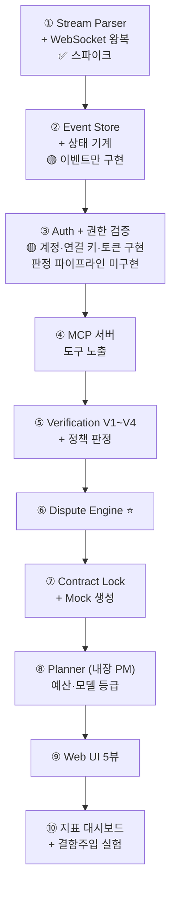

<aside>
🚨

**①은 스파이크로 풀렸고, ③의 인증 기반(로컬 계정·연결 키·토큰)과 조직·레포·경로 소유권·초대, 허용 레벨 정책표 데이터는 구현됐습니다.** 다음 병목은 **② 상태 기계**(projects·plans·tasks)입니다. 3차 회의에서 합의한 구현 순서(key 발급 → 웹소켓 → agent 상호작용 → MCP)와 일치합니다. **⑥(Dispute)에 가장 많은 시간을 배정**하세요 — 차별점의 핵심입니다. 현황은 코드와 `CLAUDE.md`.

</aside>

---

# 10. 장애 시나리오 대응

| **장애** | **감지** | **대응** |
| --- | --- | --- |
| 브릿지 연결 끊김 | 하트비트 15분 미수신 | 태스크 회수 → READY 복귀 → 재배정. 재연결 시 마지막 수신 이벤트 id부터 재개 |
| 하니스 무응답 | subprocess 타임아웃 | 강제 종료 → 1회 재시도 → ESCALATED |
| 서버 재시작 | — | events 리플레이로 상태 복원 (이벤트 소싱의 효과) |
| 태스크 수령 경합 | 조건부 UPDATE가 0행 | 한 에이전트만 수령, 나머지는 다음 태스크로 |
| 같은 경로 동시 수정 | — | 역할당 에이전트 1개 + 경로 소유권이라 구조적으로 발생하지 않음 |
| 토큰 만료 | 401 응답 | refresh_token으로 자동 갱신, 실패 시 연결 키로 재연결 안내 |
| PM 호출 실패·예산 소진 | 타임아웃 / `budget:exceed` | **PM_REVIEW 칸만** AUTO로 강등 + `PM_REVIEW_DEGRADED` 기록. HUMAN·FORBIDDEN·🔒 행은 강등 없음. 새 명세·분류는 승인 후 재개 |
| 오프라인 중 프로젝트 정지 | — | 재연결 후 제출하는 순간 0단계에서 거부 |
| 데모 중 장애 | — | 시드 스냅샷 복원 + 사전 녹화 영상 백업 |

---

# 11. 온보딩 옵션 설계 (3차 회의 반영)

<aside>
❓

**미결 사항이었던 "개발 모델 선정(폭포수/나선형/애자일)"에 대한 제안:**
별도 개념으로 넣지 말고 **기존 모드 3종(SEQUENTIAL / CONTRACT_PARALLEL / HYBRID)에 흡수**하세요. 개념이 중복되고, 모드가 5개 이상이 되면 M6(결정성) 실험 조합이 폭발합니다.

</aside>

| **온보딩 질문** | **선택지** | **시스템 반영** |
| --- | --- | --- |
| 허용 레벨 | L1 / L2 / L3 / L4 | `project_policies`로 복사 → 행동별 승인 주체 |
| PM 예산 | 금액 입력 (필수) | `budget:exceed` 기준 — PM 호출 정지 |
| 전체 예산 상한 | 금액 입력 (선택) | 토큰 게이지 기준선, 80% 알림 |
| 역할 | 초대할 때 FRONTEND / BACKEND | `project_members.team_role` |

> **팀 규모·요구사항 명확도는 묻지 않습니다** (§3.0 C "물어보지 않는 것"). 둘 다 서버와 PM이 더 정확히 압니다.

---

# 12. 확정된 사항·미결 사항

## ✅ 확정

- 사람 : 에이전트 = 1 : 1, 권한 상속
- 서버는 코드 미실행, 로컬 실행
- 이벤트 푸시 (WebSocket), 폴링 금지
- 구현 순서: key → WS → agent 상호작용 → MCP
- **NOMOS 서버: Express 5 + TypeScript + `pg`** (Fastify·Redis 아님). 결과물 앱은 Fastify + Zod
- **인증: 로컬 계정 + 개인 연결 키** (GitHub OAuth 병존 예정)
- **온보딩 순서: 가입·연결 → 조직 → 프로젝트 → 초대**
- **한 사람 = 한 조직** (다중 조직 Won't)
- **팀 역할 FRONTEND / BACKEND 2종**, 초대에서 지정, 역할당 에이전트 1개 (QA 삭제)
- **PM 에이전트는 NOMOS 내장** — NOMOS 키로 실행, PM 예산 필수, 모델 등급 분리
- **허용 레벨 L1~L4 정책표** (`action_catalog` 17행, 🔒 5행)
- **레포 완전 분리** — 통합 브랜치 없음, 레포별 dev 배포, V1B는 서버 실행
- **교차 가시성은 문서 게시판 하나**, 지표 대시보드는 대표 전용
- 시각화 대시보드는 Must (3차 회의)

## ❓ 미결 — 다음 회의 안건

- [ ]  개발 모델(폭포수/나선형/애자일) → 모드 3종에 흡수할지 최종 결정
- [ ]  Arm B 프레임워크 확정 (CrewAI vs AutoGen — 둘 다? 하나만?)
- [ ]  과제셋 8개 기능 명세 확정
- [ ]  Object Storage 선정 (S3 vs MinIO 로컬)
- [ ]  **로컬 계정 사용자의 GitHub 계정 연결 방식** — collaborator 확인·커밋 귀속에 필요 (OAuth 연결? 로그인명 입력?)
- [ ]  **비잠금 정책 행을 대표가 조정하게 할지** — 현재 해석: G1 전까지 허용
- [ ]  **PM_REVIEW에서 PM 응답을 얼마나 기다릴지** (타임아웃 값) — 강등 범위와 기록 방식은 확정: PM_REVIEW 칸만 AUTO, `PM_REVIEW_DEGRADED`
- [ ]  **소유 역할 상속 규칙** — 시드 행 대부분의 `owner_role`이 NULL이라, 최상위 행의 소유 역할을 그대로 쓰면 `tests/**` 같은 경로를 아무도 못 씀
- [ ]  **대표가 추가하는 규칙의 settings.json 표현 가능성 검사** — `/`로 앵커된 규칙이나 `x/**`로 막은 경로 안을 되살리는 조합은 거부해야 함
- [ ]  계약 검증 도구 확정 (Spectral / schemathesis) — V1B가 서버(Node)에서 돌아야 함

---

*이 문서는 구현 착수용 마스터 설계서입니다. 설계 변경 시 이 문서를 먼저 고치고 코드를 고치세요.*

- 협업 시 자잘한 소통의 불편함 + ai agent의 대중화 → 취업 후에도 회사 내부 협업 진행해야함
    
    → 개인 에이전트 협업 중개 서버 + 기록 + 문서 아카이빙 UI
