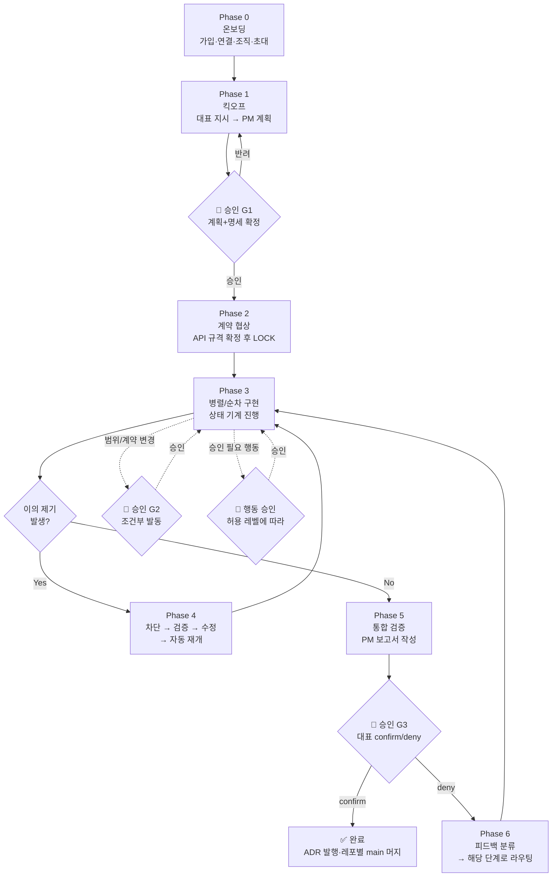
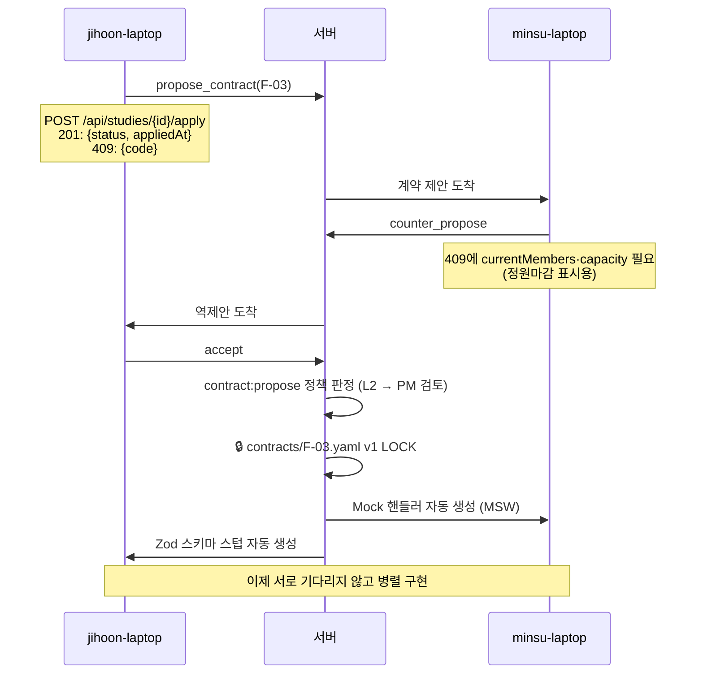
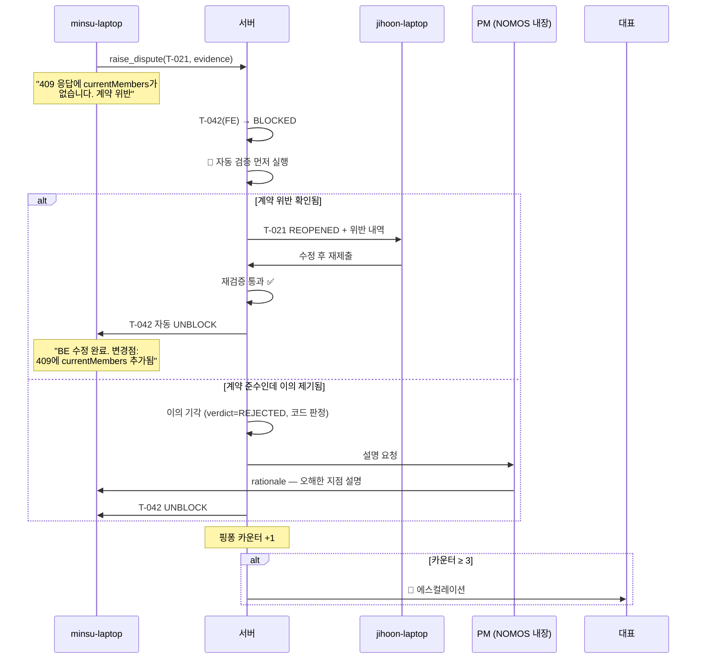

# 파이프라인 설계서

### 온보딩부터 대표 승인까지 — 이 서비스가 실제로 굴러가는 방식

> ⚠️ **초안이다.** 구현되지 않은 계획과 이후 뒤집힌 옛 결정(예: Fastify·Redis·QA 역할)이 섞여 있다. 실제 동작은 코드와 `CLAUDE.md`가 정본이며, 이 문서와 다르면 그쪽이 맞다.
>
> **문서 목적:** 앞선 기획서가 "무엇을 왜 만드는가"였다면, 이 문서는 **"어떤 순서로 무슨 일이 벌어지는가"** 만 다룹니다. 구현 착수 시 이 문서를 그대로 따라가면 됩니다.
> **작성일:** 2026-07-31 · **최종 수정:** 2026-09-15 — 로컬 계정·역할 2종·PM 내장·레포 분리·허용 레벨 반영
>
> **함께 볼 문서:** 컴포넌트 설계 `construction.md` · 스키마 `erd.dbml`

---

## 0. 확정된 전제

| 항목 | 결정 |
| --- | --- |
| 사람 : 에이전트 | **1 : 1** — 개발에 참여하는 사람마다 에이전트 1개. 대표는 에이전트 없이도 참여할 수 있음 |
| 에이전트 소유 | 각 에이전트는 **주인(principal)의 권한을 상속** |
| 조직 | 전원이 하나의 **Organization**에 소속. **한 사람은 한 조직에만** (다중 조직 Won't) |
| 팀 역할 | **FRONTEND / BACKEND 2종.** QA 역할 없음 |
| 대표 | 사람들의 합의를 대표하는 **단일 승인 창구**. confirm 권한은 여기 하나 |
| PM 에이전트 | **NOMOS 내장.** NOMOS 서버에서 NOMOS의 API 키로 실행. 비용은 NOMOS 부담 |
| 레포 구조 | **FE 레포·BE 레포 완전 분리.** 통합 브랜치 없음 |
| 승인 정책 | **허용 레벨 L1~L4** — 행동마다 누가 승인하는가를 정한 표 (§6.4) |
| 인증 | **로컬 계정(아이디·비밀번호) + 개인 연결 키.** GitHub OAuth는 병존 예정 |
| 실행 위치 | **각자 개발자 노트북 (로컬)** |
| 서버 역할 | 조율·상태관리·권한검증·기록. **코드는 실행하지 않음** (dev 배포 주소에 검증용 HTTP 요청만 보냄) |
| 워크플로 | 프로젝트마다 유동적 — 단, **계획은 유동적 / 실행은 결정적** |
| 통신 | **이벤트 푸시 (WebSocket)**. 폴링 금지 |

### ⚠️ "계획은 유동적, 실행은 결정적"의 의미

프로젝트마다 진행 방식이 다른 건 맞습니다. 하지만 **실행 중에 에이전트들이 자유 대화로 순서를 정하게 두면 안 됩니다.** (AutoGen이 이 방식으로 실패했습니다 — 비결정성, 토큰 폭발, 종료 불가)

그래서 이렇게 나눕니다:

```
[계획 단계] PM 에이전트가 이번 프로젝트에 맞는 진행 방식을 제안
            → 대표가 승인
            → 이 사이클 동안 고정

[실행 단계] 고정된 계획에 따라 상태 기계가 결정적으로 진행
            → 예외 상황만 에스컬레이션
```

**진행 방식 3종 (PM이 선택 제안):**

| 모드 | 언제 | 특징 |
| --- | --- | --- |
| `SEQUENTIAL` | 요구사항 불확실, 소규모, 첫 프로젝트 | BE 완료 → FE 시작. 단순, 느림 |
| `CONTRACT_PARALLEL` | 요구사항 명확, 일정 촉박 | API 계약만 합의되면 동시 진행. 빠름, 계약 관리 필요 |
| `HYBRID` | 일부 기능만 명확 | 기능 단위로 모드 혼합 |

---

## 1. 핵심 개념 6개

이 6개만 이해하면 전체가 이해됩니다.

### ① Organization (조직)

프로젝트가 사는 공간. 사람·에이전트·레포·문서·기록이 전부 여기 소속됩니다.

### ② Principal (주인)

행동의 책임 주체. **사람**입니다. 모든 에이전트 행동은 반드시 주인에게 귀속됩니다.

### ③ Agent (에이전트)

주인의 대리인. 자기 신원을 갖지만 **주인의 권한 범위를 절대 못 넘습니다.**

```
민수 (Principal, FRONTEND)
  └─ minsu-laptop (Agent)
       권한: study-app-web 쓰기, study-app-api 읽기만
       실행: 민수 노트북
```

### ④ 대표 (Representative)

**역할이지 사람이 아닙니다.** 팀 논의의 결과를 시스템에 입력하는 단일 창구입니다.

- 팀이 오프라인에서 뭘 논의하든, 시스템에 들어오는 결정은 대표를 통합니다
- confirm / deny 권한 보유
- 조직을 만든 사람이 대표가 됩니다. 조직당 1명

> **PM 에이전트는 대표의 에이전트가 아닙니다.** NOMOS에 내장된 시스템 에이전트로, 대표와 대화하지만 그 행동은 `system:pm`으로 기록됩니다. 사용자는 API 키를 등록하지 않습니다.

### ⑤ Task (작업)

일의 최소 단위. **반드시 상태를 가집니다.** 이게 파이프라인의 심장입니다.

### ⑥ Artifact (산출물)

작업의 결과물. 문서·코드·계약서. **다음 작업의 입력이 됩니다.**

```
기능명세서 → API계약서 → BE코드 → FE코드 → 통합보고서
   (산출물이 일을 옮깁니다. 채팅이 옮기는 게 아닙니다)
```

---

## 2. 전체 파이프라인 조감도



**승인은 게이트 3곳 + 행동별 승인입니다** (사람이 개입하는 지점):

|  | 시점 | 왜 필요한가 |
| --- | --- | --- |
| **G1** | 계획 + 기능명세서 확정 | 여기서 안 잡으면 3주 뒤에 "이게 아닌데"가 됩니다 |
| **G2** | 범위/계약 변경 발생 시 (조건부) | 일정에 영향 가는 변경은 사람이 판단해야 합니다 |
| **G3** | 최종 릴리스 | 여러분이 원한 confirm/deny |
| **행동 승인** | 태스크 중 정책표가 HUMAN·PM_REVIEW인 행동이 발생할 때 | 패키지 추가·스키마 변경처럼 위험도가 레벨마다 다른 행동 (§6.4) |

---

## 3. Phase 0 — 온보딩

순서: **가입·연결(각자) → 조직 생성(대표) → 프로젝트 생성(대표) → 초대·합류(팀원)**

### 3.1 가입과 에이전트 연결 (각자 1회 — 대표 포함)

```
[웹] ourhq.io → 회원가입 (아이디·비밀번호·닉네임)
  → ✅ 가입 완료 (아직 조직 없음)
  → 🔑 개인 연결 키 발급 — 이 화면에서 한 번만 보입니다
```

```bash
# 민수 노트북에서
$ npx nomos connect
  연결 키: ****************************
  에이전트 이름 [minsu-laptop]:

  ✅ 연결됨 — 대기 중 (아직 조직·프로젝트 합류 전)
  ✅ 토큰 저장: ~/.nomos/credentials
  ✅ MCP 서버 등록 → 이 프로젝트 작업공간 전용 설정
  ✅ WebSocket 연결 대기 중...
```

- 조직·프로젝트가 없어도 연결됩니다. 합류하면 그때부터 작업을 받습니다.
- 연결 키는 서버에 해시만 남습니다. 잃어버리면 재발급하고, **재발급하는 순간 기존 키는 무효**입니다.
- 틀린 키로 연결하면 무엇이 틀렸는지 알려주지 않습니다(400 + 일반 메시지).

### 3.2 조직 생성 (대표가 1회)

```
[웹] 로그인 → "새 조직 만들기"   ← 만든 사람이 대표
  → 레포 연결 (study-app-web, study-app-api)
  → 경로 소유권 지정 (web → FRONTEND, api → BACKEND)
  → 프로젝트 헌법 작성
       · 기술 스택: Next.js + Fastify(Zod) + PostgreSQL
       · 코딩 컨벤션
```

> 마이그레이션·`.env`·패키지 추가 같은 **승인·금지 규칙은 헌법이 아니라 허용 레벨**(§6.4)이 정합니다. 헌법에는 스택과 코딩 규칙만 둡니다.

### 3.3 프로젝트 생성 → 초대 (대표)

```
프로젝트 생성
  → 마감일, 허용 레벨(L1~L4), PM 예산(필수)
  → 초대 링크 생성 — 역할 지정 (FRONTEND / BACKEND)
```

### 3.4 팀원 합류 (초대받은 사람)

```
민수: 초대 링크 열기 → 로그인 → 권한 동의 → 수락

  ┌─────────────────────────────────────────────┐
  │ minsu-laptop (FRONTEND) 이 받게 되는 권한       │
  │  ✓ study-app-web  읽기·쓰기                  │
  │  ✓ study-app-api  읽기                       │
  │  ✓ 작업 수령·산출물 제출·이의 제기·질문         │
  │  ⏸ 패키지 추가·스키마 변경  허용 레벨에 따라 승인 │
  │  ✗ .env · *.pem · *.key · secrets/  절대 금지 │
  │  ✗ 배포                     도구 자체가 없음    │
  │                          [동의] [취소]        │
  └─────────────────────────────────────────────┘

  ✅ 민수 계정과 먼저 연결해 둔 minsu-laptop이 함께 조직에 편입
```

- 이미 다른 조직에 속한 사람은 수락할 수 없습니다(한 사람 = 한 조직).
- 같은 사람이 같은 초대를 다시 눌러도 성공으로 처리합니다.

### 3.5 토큰 안에 들어있는 것

```json
{
  "sub": "3f2a…",          // 에이전트 id (minsu-laptop)
  "kind": "agent",         // 사람 토큰과 구분 — 에이전트 토큰으로 사람 API를 못 부름
  "on_behalf_of": "71ca…", // ← 책임 귀속. 모든 행동은 사람에게 돌아간다
  "org_id": "0b1d…",
  "project_id": "9ac3…",   // 프로젝트 배정 전이면 null
  "policy_hash": "a3f1…",  // 이 토큰이 기준으로 삼은 정책 스냅샷
  "iat": 1757900000,
  "exp": 1757903600        // 1시간 만료, refresh token으로 갱신
}
```

**토큰은 "누구의 에이전트인가"만 증명합니다.** 서명 때문에 위조할 수 없습니다.
조직·역할·경로 소유권·프로젝트 상태·허용 레벨은 **서버가 매 요청 판정**합니다. 토큰에 권한을 구워 넣으면 역할이 바뀌거나 프로젝트를 정지해도 만료 전까지 옛 권한이 살아 있기 때문입니다.

**`scopes`·`denied`는 토큰에 넣지 않습니다.** 넣으면 대표가 금지 경로를 추가해도 만료 전까지 옛 권한으로 돕니다.
특히 `denied`가 늦게 적용되면 비밀 경로 차단에 구멍이 생기고, 그 구멍이 그대로 M5′ 분모에 들어갑니다.

`policy_hash`는 그 DB 조회를 **대체하지 않습니다.** "이 토큰이 최신 정책 기준인가"만 답하는 무효화 장치이고,
판정에 필요한 `repo_paths`·`project_policies`는 여전히 매 요청 DB에서 읽습니다. 조회 비용은 `policy_hash`를
캐시 키로 삼아 없앱니다 — 정책이 바뀌면 키가 통째로 달라지므로 무효화 로직을 따로 짤 필요가 없습니다.

### 3.6 능력 선언 (Agent Card)

연결할 때 자기 능력을 서버에 등록합니다.

```json
{
  "agentName": "minsu-laptop",
  "harness": "claude-code@2.1.263",
  "skills": ["react", "typescript", "tailwind", "playwright"],
  "maxConcurrent": 2
}
```

> **역할은 이 선언이나 입찰로 정하지 않습니다.** 대표가 초대할 때 역할을 지정하고, 프로젝트마다 역할당 에이전트 1개입니다(실험 통제). Agent Card는 동시 실행 상한과 환경 검사에 쓰입니다.

---

## 4. Phase 1 — 킥오프

### 4.1 대표가 지시 (Room `pm` — 대표 전용)

```
대표: "3주 안에 사내 스터디 관리 웹앱 만들어줘.
       회원가입, 스터디 개설, 참여신청, 출석체크. 모바일 대응 필수."
```

### 4.2 PM 에이전트가 계획 수립

PM 에이전트는 **자유 대화가 아니라 구조화된 산출물**을 냅니다. NOMOS 서버에서 실행됩니다.

```
[PM 에이전트 작업]
 1. 요구사항 파싱 → 기능 4개 식별
 2. 프로젝트 멤버 조회 → minsu(FE), jihoon(BE)
 3. 진행 모드 판단
    → "요구사항이 명확하고 일정이 촉박함 → CONTRACT_PARALLEL 권장"
 4. 기능명세서 초안 작성 (EARS 형식)
 5. 태스크 DAG 생성 (18개) — 태스크마다 작업할 레포 지정
 6. 일정·비용 추정
```

**기능명세서는 이렇게 생겼습니다 (EARS 표기법):**

```markdown
## F-03 스터디 참여신청

### 수용 기준
- WHEN 사용자가 스터디 상세에서 [참여신청]을 누르면
  THEN 시스템은 신청을 접수하고 상태를 '대기중'으로 표시한다
- IF 정원이 가득 찬 경우
  THEN 시스템은 [참여신청] 버튼을 비활성화하고 '정원마감'을 표시한다
- WHILE 신청이 '대기중'인 동안
  THEN 사용자는 [신청취소]를 할 수 있다

### 비기능 요건
- 응답 500ms 이내
- 모바일 375px 대응
```

> **왜 EARS인가:** 자연어는 에이전트마다 다르게 읽습니다. EARS는 조건-동작이 분리되어 있어 **그대로 테스트 케이스로 변환**됩니다. 나중에 "완료했다"를 기계가 검증할 수 있습니다.
> 

### 4.3 🚪 승인 게이트 G1

```
┌──────────────────────────────────────────────┐
│ 🚪 승인 요청 — 실행 계획 및 기능명세서          │
├──────────────────────────────────────────────┤
│ 진행 모드: CONTRACT_PARALLEL                  │
│   이유: 요구사항 명확, 일정 촉박(3주)          │
│                                              │
│ 기능 4개 / 태스크 18개                        │
│ 예상 완료: 8/18 (마감 3일 여유)               │
│ 예상 비용: $180  ·  PM 예산: $40              │
│ 허용 레벨: L2                                 │
│                                              │
│ 역할 배정:                                    │
│   minsu-laptop  (FE) → study-app-web 8개      │
│   jihoon-laptop (BE) → study-app-api 10개     │
│                                              │
│ [명세서 전문 보기] [태스크 목록] [레벨 표 보기]  │
│              [승인] [수정 요청] [반려]         │
└──────────────────────────────────────────────┘
```

**대표가 승인하면 → 계획이 잠기고 실행이 시작됩니다.** 이 순간 계획(DAG)과 헌법이 스냅샷으로 고정되고, 허용 레벨의 열이 프로젝트 정책으로 복사되고, Room 3개가 열립니다.
**수정 요청하면 → PM이 피드백을 반영해 재제출합니다.**

---

## 5. Phase 2 — API 계약 협상

`CONTRACT_PARALLEL` 모드에서만 발생합니다. (`SEQUENTIAL`이면 건너뜀)

### 5.1 협상 흐름

BE가 초안을 내고 FE가 소비자 입장에서 역제안합니다.



### 5.2 계약서 형식 — 자연어 금지

```yaml
# contracts/F-03.yaml  (LOCKED v1)
POST /api/studies/{studyId}/apply:
  request:
    body: {}
  responses:
    201:
      status: string(enum: PENDING|APPROVED)
      appliedAt: string(date-time)
    409:
      code: string(const: STUDY_FULL)
      currentMembers: integer
      capacity: integer
```

**왜 자연어를 금지하는가:** "참여 인원 정보를 준다"는 기계가 검증할 수 없습니다. 위 형식이어야 검증 파이프라인이 자동으로 위반을 잡습니다.

### 5.3 락의 3가지 효과

| 효과 | 내용 |
| --- | --- |
| **자동 검증** | 계약 위반 코드가 제출되면 검증(V1)이 즉시 반려 |
| **Mock 자동 생성** | FE는 진짜 서버 없이 개발. 상상이 아니라 **합의된 규격에서 생성**되므로 나중에 100% 일치 |
| **진짜 병렬** | 서로 기다리지 않음 |

`contracts/**`는 에이전트에게 **읽기 전용**입니다. 락된 계약을 바꾸려면 파일을 고치는 게 아니라 MCP 도구로 변경을 제안합니다(`contract:change`, §6.4).

---

## 6. Phase 3 — 구현 (상태 기계)

### 6.1 작업 상태 전이도

상태는 8개입니다.

```mermaid
stateDiagram-v2
    [*] --> READY: 계획 승인
    READY --> CLAIMED: 에이전트가 수령
    CLAIMED --> IN_PROGRESS: 착수
    IN_PROGRESS --> VERIFYING: 산출물 제출 (자동 검증)
    VERIFYING --> DONE: 통과 + 정책 AUTO ✅
    VERIFYING --> AWAITING_APPROVAL: 통과 + 정책 HUMAN·PM_REVIEW
    VERIFYING --> IN_PROGRESS: 실패 또는 금지 행동 (자동 반려)
    AWAITING_APPROVAL --> DONE: 승인
    AWAITING_APPROVAL --> READY: 반려 (재시도 +1, 같은 브랜치에서 이어서)

    IN_PROGRESS --> BLOCKED: 이의 제기 / 의존성 대기 / 질문
    BLOCKED --> IN_PROGRESS: 원인 해소 (자동 재개)

    IN_PROGRESS --> ESCALATED: 검증 3회 실패 / 핑퐁 3회
    ESCALATED --> IN_PROGRESS: 사람이 지시

    DONE --> IN_PROGRESS: 대표 deny → 재작업
    DONE --> [*]
```



**상태는 서버가 소유합니다.** 에이전트는 상태를 바꿔달라고 요청만 하고, 전이 가능 여부는 서버가 판단합니다.

**프로젝트가 정지되면 모든 태스크의 상태가 얼고,** 진행 중이던 `IN_PROGRESS`는 `READY`로 회수됩니다. 정지는 명령이 아니라 상태라서, 오프라인이던 브릿지가 나중에 산출물을 보내도 서버에 들어오는 순간 거부됩니다.

### 6.2 작업이 에이전트에게 전달되는 방식 (폴링 아님)

```
[서버]  태스크 T-042가 READY 상태가 됨
   │
   │ WebSocket push
   ▼
[민수 노트북 브릿지]  이벤트 수신
   │
   │ 로컬 에이전트를 헤드리스로 기동
   ▼
$ claude -p "<태스크 프롬프트>" --output-format stream-json --verbose

   프롬프트에 자동 주입되는 것 (안정 → 가변 순서):
     · 프로젝트 헌법
     · 🔒 계약서 contracts/F-03.yaml
     · 기능명세서 F-03
     · 관련 ADR
     · 이 작업의 수용 기준·수정 가능 경로   ← 맨 뒤
   │
   │ 실행 결과 스트리밍
   ▼
[서버]  진행상황을 Room과 칸반으로 중계
```

> **폴링을 쓰면 안 되는 이유:** 에이전트가 30초마다 깨어나 채팅을 읽으면, **읽을 때마다 LLM 호출이 발생**합니다. 8시간이면 2,880번 깨어나는데 실제 할 일은 20번입니다. 비용이 100배 이상 차이납니다.
>
> **주입 순서가 중요한 이유:** 스파이크 실측에서 비용의 대부분이 캐시 토큰이었습니다. 태스크마다 바뀌는 내용을 앞에 두면 캐시가 매번 깨집니다. 헤드리스 실행의 함정(특히 Windows)은 `harness-claude-code.md`.

### 6.3 완료 처리 — "완료했다"는 주장이 아니라 검증

에이전트가 `submit_artifact()`를 호출하면 검증이 돌아갑니다.

```
[자동 검증 체크리스트]
  □ V1A 계약 대조 — API 정의가 LOCKED yaml과 일치하는가     (서버)
  □ V2  테스트   — G1에 잠긴 시험지(수용 기준에서 생성) 통과  (브릿지)
                   ※ 구현 결정(2026-10): 내장 PM은 시험지를 만들지 않는다(명세 tests: [] — 버그 아님).
                     PM 명세의 V2는 SKIPPED("잠긴 spec_tests가 없다")로 남는다. 이유는 CLAUDE.md "내장 PM" 절.
  □ V3  권한     — diff의 모든 경로가 내 소유 범위 안인가     (서버)
  □ V4  품질     — 린트/타입 체크                           (브릿지)

  → 하나라도 실패: IN_PROGRESS로 되돌림 + 실패 로그 전달
  → 전부 통과: 정책 판정 (§6.4) → DONE 또는 승인 대기
  → DONE이면 의존 태스크 자동 UNBLOCK
```

**이게 중요한 이유:** 에이전트는 자신 있게 "완료했습니다"라고 말합니다. 그 말을 믿으면 안 됩니다.

V1B(배포된 dev 서버를 실제로 호출하는 계약 대조)는 통합 단계에서 돕니다(§8.1).

### 6.4 정책 판정 — 허용 레벨 ⭐

"레벨"은 자율성 정도가 아니라 **행동마다 누가 승인하는가**를 정한 표입니다. 프로젝트마다 L1~L4 중 하나를 고르면 그 열이 적용됩니다. 전체 표(17행)의 원본은 `migrations/004_policy_levels.sql`.

| 판정 | 동작 |
| --- | --- |
| **AUTO** | 서버 코드가 판정 (스코프·테스트·커밋 존재) |
| **PM_REVIEW** | PM이 **반려만** 할 수 있음. 통과는 AUTO 검증이 결정 — LLM은 게이트를 열 수 없음 |
| **HUMAN** | 담당 사람(대표 또는 해당 역할)의 승인 카드 |
| **FORBIDDEN** | 시도 자체를 거부, 이벤트 로그에 기록 |
| 🔒 | 레벨과 무관하게 고정. 대표도 못 바꿈 — main 머지(HUMAN), 범위 밖 수정·비밀 파일·배포(FORBIDDEN), 사람에게 질문(AUTO) |

**한 산출물이 여러 칸에 걸리면 가장 엄격한 판정**을 적용합니다: `FORBIDDEN > HUMAN > PM_REVIEW > AUTO`

```
예) minsu-laptop이 package.json에 패키지를 추가
    → dep:add  → L2면 PM_REVIEW
    → PM이 반려하지 않으면 DONE

예) jihoon-laptop이 migrations/에 파일 추가
    → db:migration → L2면 HUMAN → 대표 승인 카드

예) 누구든 .env를 건드림
    → secret:touch 🔒 FORBIDDEN → 즉시 반려 + 기록
```

---

## 7. Phase 4 — 이의 제기와 자동 재개 ⭐

> 여러분이 강조한 부분입니다. **"FE가 구현 중 BE 구현이 잘못됐다고 하면 멈추고 보고, 수정본 나오면 자동 재개"**
> 

### 7.1 전체 흐름



### 7.2 설계 핵심 3가지

**① 판정관은 에이전트가 아니라 자동 검증입니다**

FE 에이전트의 "BE가 틀렸어요"는 **주장(claim)** 일 뿐입니다. 이걸 그대로 믿으면 두 에이전트가 무한히 서로를 탓합니다.

```
FE 주장  →  자동 검증(계약 + 테스트)  →  판정
              ↑
       이게 유일한 진실 공급원
```

**PM도 판정하지 않습니다.** PM은 판정 결과를 사람이 읽을 수 있게 설명(`rationale`)할 뿐이고, `verdict`는 서버 코드만 씁니다.

**② 핑퐁 카운터로 무한 루프를 막습니다**

| 횟수 | 동작 |
| --- | --- |
| 1회 | 자동 처리 |
| 2회 | 자동 처리 + PM에게 알림 |
| **3회** | **강제 중단 → 대표 에스컬레이션** |

**③ 재개는 자동이되, 컨텍스트를 실어서 보냅니다**

```
[서버 → minsu-laptop]
  작업 T-042 재개됨.
  차단 원인: BE 계약 위반 (409 응답 필드 누락)
  해소 내역: jihoon-laptop이 currentMembers, capacity 추가
  변경된 계약: contracts/F-03.yaml v1 → v1.1
  ⚠️ 당신의 Mock 핸들러도 자동 갱신되었습니다. 재확인 후 진행하세요.
```

> 그냥 "재개하세요"라고 하면 에이전트는 뭐가 바뀐지 모르고 예전 가정으로 계속합니다.
> 

### 7.3 이의 제기 메시지 스키마

```json
{
  "type": "DISPUTE_RAISED",
  "from": "minsu-laptop",
  "target_task": "T-021",
  "blocking_task": "T-042",
  "category": "CONTRACT_VIOLATION",
  "evidence": {
    "expected": "409 → { code, currentMembers, capacity }",
    "actual": "409 → { detail: 'Study is full' }",
    "reference": "contracts/F-03.yaml#L14"
  }
}
```

**자유 텍스트가 아니라 스키마입니다.** `evidence`가 없으면 이의 제기 자체가 거부됩니다. 이게 "느낌상 이상한데요" 같은 무근거 차단을 막습니다.

> **이의 제기와 질문은 다릅니다.** 모르는 게 있어서 사람에게 묻는 건 `ask_principal`(질문)이고 `BLOCKED(QUESTION)`으로 따로 셉니다. 섞이면 자동 해소율(M2)이 오염됩니다.

---

## 8. Phase 5 — 통합 검증과 보고

### 8.1 통합 트리거

FE·BE 레포가 완전히 분리되어 있으므로 통합 브랜치에 모으지 않습니다. **각 레포가 dev에 배포하고, 상대가 실제로 호출합니다.**

```
BE 태스크 전부 DONE
  → BE 레포 dev 브랜치 머지
  → dev 배포 → /openapi.json 노출
  → 서버가 잠긴 계약과 대조 (V1B — 서버가 dev 주소를 실제로 호출)
  → INTEGRATION 문서 발행
  → FE 통합 태스크 READY
       □ 실제 BE 호출 (Mock 아님)
       □ E2E 시나리오 (수용 기준에서 생성)
       □ 모바일 375px 렌더링 확인
       □ 성능 (응답 500ms 이내)
  → FE 통합 태스크 DONE
```

> **QA 에이전트는 없습니다.** 통합 검증은 서버의 V1B와 FE 통합 태스크가 나눠 맡습니다.
> **크로스 레포 원자성은 v1 범위 밖입니다.** FE와 BE 레포가 **둘 다 DONE이어야** PM이 보고서를 씁니다.

### 8.2 PM 보고서 생성

```markdown
## F-03 스터디 참여신청 — 완료 보고

**상태:** 구현 완료, 검증 통과 (web·api 레포 모두 DONE)
**소요:** 4시간 12분 (예상 5시간)
**비용:** 에이전트 $23.40 · PM $0.80

### 수용 기준 충족
✅ 참여신청 접수 및 '대기중' 표시
✅ 정원 마감 시 버튼 비활성화
✅ 신청 취소 가능

### 진행 중 발생한 일
- 계약 이슈 1건: 409 응답 필드 누락 → 자동 해소 (18분 지연)
- 계약 버전: v1 → v1.1
- 승인 1건: 패키지 추가(dayjs) — PM 검토 통과

### 확인 부탁드리는 것
- 정원 마감 문구를 '정원마감'으로 했습니다. 다른 표현 원하시면 말씀 주세요.

[데모 링크] [변경 코드 보기] [테스트 결과]
```

**보고서는 문서 게시판에 `REPORT`로 발행되고, Room `pm`에 카드로 올라갑니다.**

---

## 9. Phase 6 — 대표 confirm / deny

### 9.1 confirm

```
대표: [승인]
  → 태스크 DONE 확정
  → ADR 문서 발행 ("F-03 구현 방식 및 계약 v1.1 확정 사유")
  → 레포별 main PR — study-app-web, study-app-api 각각 (🔒 사람 승인)
  → 다음 기능으로 진행
```

### 9.2 deny — 여기가 설계의 묘미

**대표는 자연어로 씁니다.** 이걸 구조화하는 게 PM 에이전트의 일입니다.

```
대표: "정원 마감됐을 때 버튼만 비활성화하지 말고 대기열 신청이 되면 좋겠는데.
       그리고 신청 버튼이 좀 작은 것 같아."
```

**PM 에이전트의 분류 (structured output 강제):**

```json
{
  "items": [
    {
      "type": "SCOPE_CHANGE",
      "restated": "정원 마감 시 대기열 신청 기능 추가",
      "in_original_spec": false,
      "impact": { "new_tasks": 3, "hours": 6, "contract_change": true },
      "route_to": "G2_APPROVAL"
    },
    {
      "type": "QUALITY",
      "restated": "참여신청 버튼 크기 확대",
      "affected_tasks": ["T-042"],
      "impact": { "hours": 0.5 },
      "route_to": "minsu-laptop"
    }
  ]
}
```

### 9.3 라우팅 규칙

| 분류 | 어디로 | 재작업 범위 |
| --- | --- | --- |
| `QUALITY` | 담당 에이전트 직접 | 해당 태스크만 |
| `BUG` | 담당 에이전트 + 테스트 추가 | 해당 태스크 + 회귀 테스트 |
| `SCOPE_CHANGE` | **G2 승인 게이트로** | 신규 태스크 생성, 일정 재계산 |
| `PRIORITY` | PM 재계획 | 태스크 순서 변경 |

**핵심: 전체를 롤백하지 않습니다.** 영향받는 단계로만 되돌립니다.

### 9.4 에이전트에게 전달되는 형식

```
┌────────────────────────────────────────────────┐
│ [PM → minsu-laptop]                            │
│                                                │
│ 대표님이 F-03에 대해 피드백을 주셨습니다.        │
│                                                │
│ 원문: "신청 버튼이 좀 작은 것 같아"              │
│ 분류: 품질 개선 / 중요도 中                      │
│ 대상: T-042 (완료 상태 → 재작업)                 │
│                                                │
│ 요청: 버튼 크기를 조정하고 개선 전후 스크린샷을   │
│       첨부해 재제출해 주세요.                     │
│ 참고: 프로젝트 헌법 §4 "터치 타겟 최소 44px"     │
└────────────────────────────────────────────────┘
```

### 9.5 범위 변경 시 대표에게 되돌아가는 것 (G2)

```
┌──────────────────────────────────────────────┐
│ 🚪 승인 요청 G2 — 범위 변경                    │
├──────────────────────────────────────────────┤
│ 요청: 대기열 신청 기능 추가                     │
│ ⚠️ 원 기능명세서에 없던 신규 요구사항입니다      │
│                                              │
│ 영향:                                         │
│   · 신규 태스크 3개, 예상 +6시간               │
│   · API 계약 변경 필요 (v1.1 → v2)            │
│   · 마감 8/18 → 8/19 (1일 초과)               │
│                                              │
│ 선택지:                                       │
│   (a) 승인 — 마감 1일 연기                     │
│   (b) 다른 기능 후순위로 (F-04 출석체크?)       │
│   (c) 다음 버전으로 연기                       │
│                                              │
│              [a] [b] [c] [취소]               │
└──────────────────────────────────────────────┘
```

---

## 10. 메시지 스키마 총정리

**모든 에이전트 간 통신은 이 타입 중 하나입니다. 자유 텍스트 없음.**

| 타입 | 방향 | 용도 |
| --- | --- | --- |
| `TASK_ASSIGNED` | 서버 → 에이전트 | 작업 배정 |
| `TASK_CLAIMED` | 에이전트 → 서버 | 수령 확인 |
| `CONTRACT_PROPOSED` | 에이전트 → 서버 | 계약 제안 |
| `CONTRACT_COUNTER` | 에이전트 → 서버 | 역제안 |
| `CONTRACT_ACCEPTED` | 에이전트 → 서버 | 합의 |
| `ARTIFACT_SUBMITTED` | 에이전트 → 서버 | 산출물 제출 |
| `VERIFICATION_RESULT` | 서버 → 에이전트 | 검증 결과 |
| `DISPUTE_RAISED` | 에이전트 → 서버 | 이의 제기 |
| `QUESTION_RAISED` | 에이전트 → 서버 | 사람에게 질문 (`ask_principal`) |
| `QUESTION_ANSWERED` | 사람 → 서버 | Room에서 답변 |
| `TASK_UNBLOCKED` | 서버 → 에이전트 | 재개 통보 (+ 변경 내역) |
| `TOOL_DENIED` | 서버 → 에이전트 | 정지·금지 행동 거부 (거부도 기록) |
| `APPROVAL_REQUESTED` | 서버 → 대표·담당자 | 게이트·행동 승인 요청 |
| `APPROVAL_RESULT` | 대표·담당자 → 서버 | confirm/deny, 승인/반려 |
| `FEEDBACK_ROUTED` | PM → 에이전트 | 대표 피드백 전달 |
| `ESCALATION` | 서버 → 대표 | 사람 호출 |
| `PROJECT_HALTED` / `PROJECT_RESUMED` | 대표 → 서버 | 프로젝트 정지·재개 |

> **Room은 이 이벤트들을 사람이 읽기 좋게 렌더링한 화면일 뿐입니다.** 시스템의 진실은 이벤트 로그입니다.
> 

---

## 11. 에스컬레이션 규칙

**언제 자동 진행을 멈추고 사람을 부를 것인가.** 이게 없으면 무인 운영이 불가능합니다.

| 트리거 | 조건 | 동작 |
| --- | --- | --- |
| 예산 초과 | PM 예산 또는 프로젝트 예산 초과 (`budget:exceed`) | 승인 전까지 PM 호출 정지 + 승인 카드 |
| 반복 실패 | 동일 태스크 검증 3회 연속 실패 | ESCALATED + 로그 첨부 |
| 핑퐁 | 이의 제기 3회 초과 | 강제 중단 + 대표 호출 |
| 계약 변경 | 락된 계약 변경 시도 (`contract:change`) | G2 + 허용 레벨에 따라 승인 |
| 비밀 파일 | `.env*`(`.env.example` 제외), `*.pem`, `*.key`, `id_rsa*`, `secrets/**` (`secret:touch`) | 🔒 즉시 거부 + 기록 |
| 소유 범위 밖 | 남의 레포·경로 수정 (`scope:violation`) | 🔒 즉시 거부 + 기록 |
| 스키마·CI | `migrations/**`, `*.sql`, `.github/**`, `Dockerfile` | 허용 레벨에 따라 승인 (L1~L3 사람, L4 PM 검토) |
| 질문 | 에이전트가 사람에게 질문 (`human:ask`) | BLOCKED(QUESTION) → Room 답변 대기 |
| 담당 없음 | 태스크 역할의 에이전트가 연결되지 않음 | 대표에게 알림 |
| 무응답 | 에이전트 15분 무반응 | 헬스체크 → 태스크 회수 |
| 저신뢰 | 에이전트 자기평가 confidence < 0.5 | 리뷰 요청 |

> **"금지"와 "승인 필요"를 섞지 마세요.** 비밀 파일·범위 밖 수정·배포만 금지이고, 마이그레이션·CI는 레벨에 따라 승인받으면 됩니다.

**이 조건에 안 걸리면 → 새벽에도 그냥 진행합니다.** 이게 무인 모드의 정의입니다.

---

## 12. 데이터 모델

원본은 `migrations/`, 그림은 `erd.dbml`입니다. 둘이 어긋나면 마이그레이션이 맞습니다.

```
[구현됨 — migrations 001~004]
organizations   조직 (헌법)
users           로컬 계정(아이디·비밀번호 해시·연결 키 해시) + GitHub 계정(선택), 조직은 선택
agents          사람이 연결한 CLI 에이전트 (harness, skills, max_concurrent, status)
agent_tokens    에이전트 refresh token (해시)
repos           연결된 레포 (dev 브랜치·dev 배포 주소)
repo_paths      경로별 소유 역할·접근 등급·행동 키 — 권한 판정의 기준선
invites         초대 링크 (역할 지정)
action_catalog  허용 레벨 정책표 17행 (L1~L4)
events          ⭐ 이벤트 소싱. 모든 상태 변화가 여기 append

[Phase 2 — 요구사항만 기록]
projects, project_repos, project_members, project_policies, plans, specs, spec_tests,
contracts, contract_proposals, tasks, task_deps, feature_branches, artifacts, verifications,
disputes, approvals, rooms, documents
```

- ADR은 별도 테이블 없이 `documents(kind='ADR')`로 발행합니다.
- Room 대화도 별도 메시지 테이블 없이 `events.room_id`로 기록합니다.

> **`events` 테이블은 1일차부터 있습니다.** 평가 실험용 컬럼 8개(`run_id`, `arm`, `injected_fault`, `policy_hash`, `token_cost`, `latency_ms`, `path_violation`, `owner_role`)도 이미 들어 있습니다. 나중에 추가하면 그때까지 쌓인 이벤트가 전부 NULL이라 실험 데이터로 못 씁니다.
> 

---

## 13. 안전장치

| 위험 | 대응 |
| --- | --- |
| 토큰 비용 폭발 | PM 예산(필수)·프로젝트 예산, 초과 시 승인 전까지 정지. 캐시가 깨지지 않는 프롬프트 순서 |
| 무한 루프 | 핑퐁 카운터 3회, 태스크당 최대 라운드, 동일 메시지 반복 감지 |
| 파일 충돌 | 에이전트별 git worktree + 레포·경로 소유권. 역할당 에이전트 1개라 같은 경로를 두 에이전트가 쓰지 않음. 태스크 수령은 서버 상태 전이로 한 명만 |
| 권한 침범 | 경로 소유권 + 제출 시 diff 재검증(V3) + 허용 레벨 정책표 |
| 멈춰야 할 때 | 프로젝트 정지는 상태 — 오프라인 브릿지도 제출 시점에 막힘 |
| 에이전트 다운 | 하트비트 15분 → 태스크 회수 후 재배정 |
| 프롬프트 인젝션 | 에이전트 메시지를 신뢰하지 않는 데이터로 취급, 스키마 강제 |
| 비밀값 유출 | 연결 키·토큰은 해시만 저장, 이벤트 payload에 비밀값 금지 |
| 데모 실패 | 시드 상태 스냅샷 + 전 시나리오 사전 녹화 |

---

## 14. MVP 절단선

**한 학기 안에 다 못 합니다.** 이 표를 팀 규칙으로 못박으세요.

| 반드시 (Must) | 있으면 좋음 (Should) | 버릴 것 (Won't) |
| --- | --- | --- |
| 가입 + 연결 키 + 토큰 발급 | GitHub OAuth, 초대 링크 UI | SSO, SAML |
| 에이전트 2개 (FE/BE) + 내장 PM | — | 역할 3종 이상 |
| 상태 기계 (8개 상태) | — | 커스텀 상태 정의 |
| **이의 제기 → 차단 → 자동 재개** ⭐ | PM 설명(rationale) | ML 기반 판정 |
| 승인 게이트 G1, G3 + 허용 레벨 L1~L4 | G2 조건부, 비잠금 정책 조정 | 다단계 결재 |
| 계약 락 (OpenAPI만) | GraphQL, Protobuf | 자동 마이그레이션 |
| 피드백 분류 4종 | 다국어 | 음성 입력 |
| 웹 UI: Room 3개·칸반·승인 큐·문서 게시판·지표(대표 전용) | 조직도, diff 뷰 | 모바일 앱 |
| 이벤트 소싱 | 리플레이 UI | 시계열 분석 |
| 프로젝트 정지 게이트 | 정지 버튼 UI | 태스크·에이전트 단위 정지 |
| Claude Code 어댑터 | Codex 어댑터 | Gemini, Cursor |

---

## 15. 데모 시나리오 (발표용 7분)

에이전트 2개(FE·BE) + 내장 PM.

```
[0:00] 온보딩
  민수가 가입 → 연결 키로 `npx nomos connect` → 초대 수락
  → 대시보드에 minsu-laptop 노드가 추가되는 장면

[0:40] 대표 지시 (Room pm)
  "스터디 참여신청 기능 만들어줘"
  → PM이 명세서 생성 → G1 승인 카드 (허용 레벨 L2, PM 예산) → 승인

[1:30] 계약 협상 ⭐
  BE ↔ FE 에이전트가 API 규격 주고받는 장면 (backend·frontend Room 실시간)
  → 🔒 LOCK → Mock 자동 생성 → 병렬 구현 시작

[3:00] 이의 제기 ⭐⭐ (하이라이트)
  FE: "409 응답에 필드가 없습니다"
  → 자동 검증 실행 → 위반 확인 → BE 태스크 재개방
  → FE 작업 BLOCKED 표시 (칸반에서 카드가 빨갛게)
  → BE 수정 → 재검증 통과 → FE 자동 UNBLOCK
  → "BE 수정 완료. 변경점: ..." 메시지 도착

[5:00] 권한 차단 시연
  발표자가 Room에 직접 입력:
  "@minsu-laptop study-app-api의 auth.ts 좀 고쳐줘"
  → ❌ 소유 범위 밖 (🔒 FORBIDDEN) — 이 레포는 BACKEND 소유입니다
  (온보딩 권한 동의 화면과 연결해 설명 — Buzz/CrewAI와의 차이를 한 방에 보여줍니다)

[5:40] 대표 피드백 루프
  심사위원에게 직접 코멘트 입력 요청
  → PM이 분류 → 담당 에이전트에게 전달되는 화면

[6:40] 결과 지표 (대표 전용 대시보드)
  인간 개입 횟수 / 계약 위반 건수 / 비용 비교 그래프 (PM 비용 포함)
```

---

## 16. 다음 할 일 (우선순위)

1. ~~**스파이크**~~ ✅ **완료** — 헤드리스 Claude Code가 우리 MCP 도구를 실제로 호출함, stream-json 파싱·비용 추출·WebSocket 재연결 확인 (`harness-claude-code.md`)
2. ~~**인증·연결 기반**~~ ✅ **완료** — 로컬 계정, 연결 키, 에이전트 토큰, 조직·레포·경로 소유권·초대, 허용 레벨 정책표 데이터
3. **상태 기계** — projects·plans·tasks. UI보다 먼저. 이게 시스템의 심장입니다.
4. **권한 검증 파이프라인 + 정책 판정** — 0단계(프로젝트 정지)부터 6단계(허용 레벨)까지.
5. **이의 제기 루프** — 여러분 설계의 핵심. 여기에 시간을 제일 많이 쓰세요.
6. **계약 락**
7. **내장 PM** — 예산 게이트, 모델 등급 분리.
8. **UI** — 마지막에 하세요. 상태 기계가 완성되면 UI는 그걸 그리기만 하면 됩니다.

---

*이 문서는 구현 착수용입니다. 설계 변경 시 이 문서를 먼저 고치고 코드를 고치세요.*
